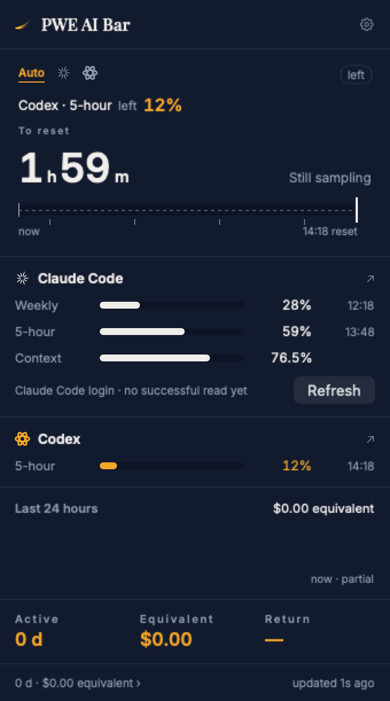
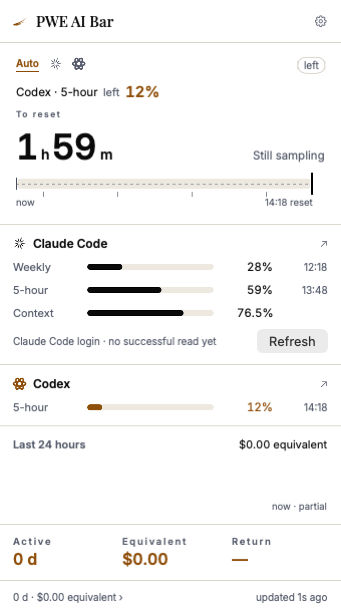

<div align="center">

# PWE AI Bar

**Every AI coding quota you have, in the 22 points beside your clock.**
But its real job is to find you at the moment it is your turn.

[](https://github.com/kenshinice-ai/pwe-ai-bar/releases/latest)
[](#install)
[](#install)
[](LICENSE)

*A PARADISE PRODUCTION · 天域文创出品*

**English** · [简体中文](README.zh-Hans.md)


 

<sub>English and 简体中文, following the Mac or set in the app.</sub>

</div>

---

## Install

```bash
brew install --cask kenshinice-ai/tap/pwe-ai-bar
```

Or download the `.dmg` from [pwestudio.site/aibar](https://pwestudio.site/aibar). They are the same
file, signed and notarised by Apple — **it opens with no security warning**, no right-click "Open",
nothing to allow in privacy settings. If your copy warns you, it is not one of ours.

Requires **macOS 13 or later on an Apple Silicon Mac**. There is no Intel build.

**English and 简体中文**, switchable in settings. The default follows the system — but following
the system is not enough on its own: plenty of Chinese speakers run macOS in English on purpose
and would never see the Chinese build, so both are offered explicitly.

If you are already signed in to Claude Code, the app reuses that login — no re-entering an account,
and no keychain authorisation dialog either. Why not, below.

---

## What it does

### The dashboard

- **Claude Code**'s five-hour and weekly windows as real percentages from `/api/oauth/usage`,
  with model-scoped limits listed separately
- **Codex**, read from its own app server, with no credentials at all
- The current session's context usage
- Five more, read-only (see the table below)
- **A trophy page**: what the same work would have cost at API list prices, the return against your
  actual plan, a breakdown by model and by day, over a date range you choose

### The endurance gauge

The top of the panel is a countdown bar. The largest number below it answers exactly one question:
**at this pace, do you reach the reset?**

Every reading these services return is a whole number, and long plateaus are normal. The error is
not Gaussian noise to be smoothed away — it is quantisation. So there is no regression here, no
EWMA and no Kalman filter: all three would be averaging an ε that does not exist. Two bounds
instead, over a span of *S* hours:

```
rate.low  = max(0, Δp − 1) / S
rate.high = (Δp + 1) / S
```

One expression, three properties worth having. A plateau yields only an upper bound, which gives a
*lower* bound on endurance — so it can say "at least this long" and mean it. A single-step jump has
a lower bound of zero, so one step can never announce that you are going to run out. And a burst
decays on its own as *S* grows. The width of the interval is where the uncertainty goes; there is
no confidence knob because there does not need to be one. Seven verdicts, each with its own tone.

Full specification: [docs/FORECAST_ENGINE_SPEC_2026-09-06.md](docs/FORECAST_ENGINE_SPEC_2026-09-06.md)

### The sentinel

The dashboard is the part a dozen other tools already do. This is the part actually worth
installing something for:

- **Your quota reset** — it tells you when you can start again, rather than you checking
- **Claude is waiting on you** — a permission prompt has stalled; the menu bar steps aside and a
  notification arrives
- **You walked away** — more than five minutes from the keyboard and the alert forwards to your
  phone through ntfy or Bark

Session events need hooks: **Settings → 会话事件 / Session events → Install**. Three hooks are
merged into your existing `~/.claude/settings.json` rather than written over it, after validating
it and keeping a byte-for-byte backup; installation stops on a config that is corrupt, unreadable
or a symlink, and installing twice does not add them twice.

| Hook | What it is for |
|---|---|
| `Notification` | Claude has stopped and is waiting → the menu bar steps aside, a notification arrives |
| `UserPromptSubmit` | You replied → the waiting state clears immediately, rather than at the end of the turn |
| `Stop` | Task finished → alert only if you have walked away |

`UserPromptSubmit` records no text at all — its payload is the thing you just typed, and this event
only needs to end the waiting state.

---

## It does not ask for your password

macOS grants keychain access per item **per program**. Claude Code writes its own credential by
shelling out to `/usr/bin/security`, so that binary is already on the item's ACL. **Reading it the
same way is therefore silent** — no dialog, no "Always Allow", and no prompt after the app is
re-signed either. The cost is one subprocess, about 20 ms.

The token goes to `api.anthropic.com` and nowhere else. **No telemetry, no crash reporting, and no
account of any kind.**

The diagnostics print no tokens, account identifiers or server bodies:

| Command | What it does |
|---|---|
| `--cred` | Configuration only |
| `--credentials-read-only` | Queries the quota but does **not** rotate the token |
| `--credentials` | The full query and renewal path |
| `--popover` | Opens the real panel and prints its geometry |

---

## Why the eight are all different

| | How it is read | Authorisation? |
|---|---|---|
| **Claude Code** | `api.anthropic.com/api/oauth/usage`, credential read back exactly the way the CLI writes it | none |
| **Codex** | `account/rateLimits/read` on `codex app-server`; falls back to the rollout log | none |
| **Cursor** | the editor's own `state.vscdb`, then Connect RPC to `api2.cursor.sh` | none |
| **GitHub Copilot** | plugin config → `gh`'s hosts.yml → `gh`'s keychain item, then `copilot_internal/user` | none |
| **Devin** | `~/.local/share/devin/credentials.toml`, then `server.codeium.com` | none |
| **Grok** | `~/.grok/auth.json`, then `cli-chat-proxy.grok.com` | none |
| **Antigravity** | Google's OAuth document in the keychain, then Cloud Code | none |
| **Gemini** | **Not readable.** The desktop app keeps only a settings database with no quota field; the CLI's `gemini_cli.token.usage` is a token count, not a quota | — |

We did not choose eight different methods for eight tools — each of them decided what it writes to
disk, and this is what is there.

Three rules hold for every provider:

- **Read-only.** No token is refreshed, no credential file is written. Someone else's login is
  theirs to manage, and the worst thing this app could do is tear a session in half and log
  somebody out of the tool they are working in.
- **Nothing uninvited.** No credential found means not installed, and no request is made. The
  keychain is stricter still: an item is only ever asked for when that app is installed on this
  Mac — asking about a tool that is not there manufactures a password prompt out of nothing.
- **Bounded.** Every subprocess has a deadline and every request a timeout, and one slow provider
  does not hold up the rest (parallel, not queued).

**Only Claude Code and Codex are on by default.** The other five are listed in settings, showing
whether they were detected, and you switch them on yourself — switching one on means sending a
credential found on your Mac to a vendor you did not ask us to contact. Every other permission this
app has is given rather than taken, and an outbound request carrying a token should not be the
exception.

---

## Before you install

Better said here than discovered later.

- **Claude Code and Codex are the two that are proven.** The other five — Cursor, Copilot, Devin,
  Grok, Antigravity — have never been checked against a real account, because none of them is
  installed on the machine this was built on. They are read-only, gated on the app being present,
  and time out; but "it should work" is not "it works". Three of them report the reading inverted
  (Devin and Antigravity report what is **left**, Cursor and Grok what is **used**), and a test
  watches that specifically.
- **It can renew an expired Claude Code token.** Claude Code has been observed leaving its
  credential expired for 32 hours, so the app refreshes it and writes the replacement back to the
  same place. Four invariants and their regression tests exist precisely because getting this wrong
  would log you out of your own CLI. The success path has now completed once against a real
  account; **the failure path — renewed but could not be written back — still has not.**
- **The subscription price comes from a table.** Pro and Max monthly prices ship in `pricing.json`
  and are picked by the plan tier in your credential; **settings can override them, in USD or
  AUD**. When the tier cannot be determined the page shows the equivalent cost and **no return
  multiple** — a ratio built on a price nobody confirmed reads exactly as confidently as a correct
  one.

---

## Building from source

No third-party dependencies.

```bash
swift test                      # 128 tests
./scripts/build-app.sh          # assembles and signs into build/PWE AI Bar.app
open "build/PWE AI Bar.app"
```

A local build is ad-hoc or Apple Development signed and runs only on the machine that made it;
Developer ID signing and notarisation happen on the release machine.

The string tables are a **build gate**, not a reminder: `Tools/loccheck` runs before anything is
compiled and fails on a key used in the sources but missing from `zh-Hans.lproj`, on a translation
nothing uses any more, and on one key given two different English texts. English lives at each call
site and `en.lproj` is generated from it, so drift is possible in one direction only.

Before changing anything, read **[docs/HANDOFF.md](docs/HANDOFF.md)** — it covers the mechanisms
that are not obvious from the code (why no keychain dialog appears, the four invariants around
token renewal, why the rate is an interval, and how the localisation fails *silently* if you move
one directory), and for each of them, what the previous version got wrong. The full design document
is [docs/design.html](docs/design.html).

---

## Licence

The source is [MIT](LICENSE) — this app reads your credentials, so you should be able to see what
it does with them and build a copy yourself to check.

**The brand is not included**: the names, the wing mark and its vector data, the application icon
and the slogan. Fork it, change it, redistribute it — but a redistributed build must not carry the
wing or use the PWE or Paradise Production names in a way that suggests it is the official release.
Replace `Sources/PWEAIBar/Brand/` and the application name with your own.

The bundled Inter and Playfair Display fonts are not ours to license; both are SIL OFL 1.1.

The fourth in PWE Studio's menu-bar family, after Loan Bar, Lumen Bar and MAC MONITOR — all at
[pwestudio.site](https://pwestudio.site).

A Paradise Production · 天域文创出品
