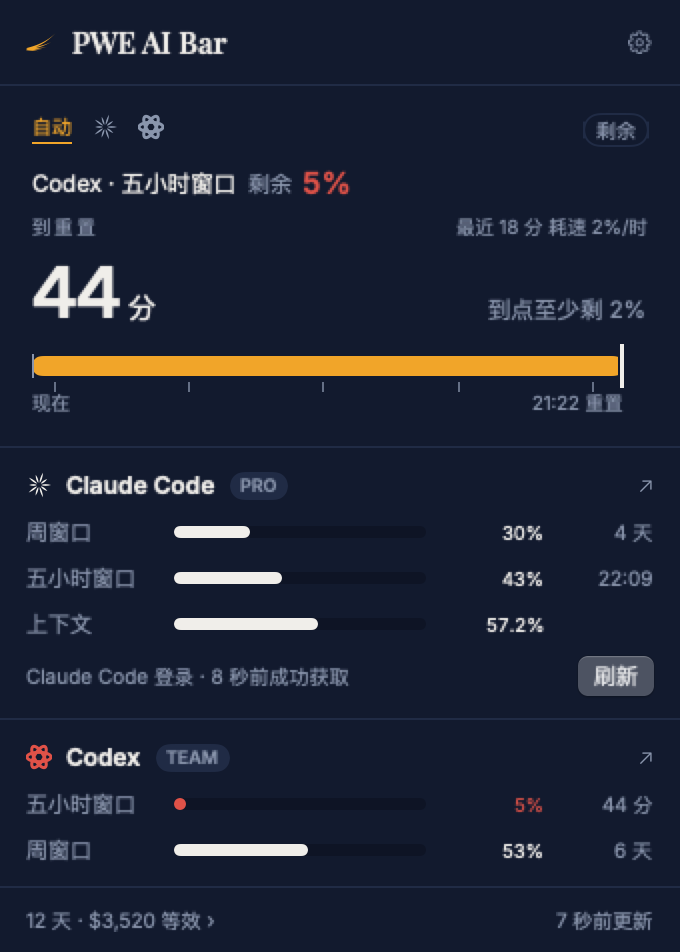

# PWE AI Bar

**你所有 AI 的额度，收进菜单栏那 22 点。但它的本职是在该你出手的那一刻找到你。**

PWE Studio 菜单栏家族的第四位，接在 Loan Bar、Lumen Bar、MAC MONITOR 之后。


```
[翼] ✳ 68% / 88%   ⚛ 额度耗尽   ↻17:18
```

翼形仪表 · Claude 的五小时与周窗口 · Codex 状态 · 距重置倒计时。



点开是一块倒计时：最上面一排挑看哪一家（或者交给「自动」——离拦住你最近的那个），
下面那个最大的数字回答唯一要紧的问题——按这个节奏，到不到得了重置。

---

## 它做什么

**看板**（这部分市面上已有二十几个实现，我们只是做得合乎自家规范）

- Claude Code 的五小时与周窗口，真实百分比，来自 `/api/oauth/usage`
- Codex 额度，读它自己的会话日志，零凭据
- 当前会话上下文占用
- 战绩页：按 API 目录价折算的等效成本、回本倍数、模型与日期分布

**哨兵**（这部分没人做）

- **额度重置了** —— 到点主动告诉你可以继续干活
- **Claude 在等你回话** —— 权限确认卡住时，菜单栏让位、通知弹出
- **离座推手机** —— 超过五分钟没碰键盘，提醒转发到 ntfy / Bark
- 阈值预警用服务端自己的 `severity`，不是我们瞎定的数字

## 装

```bash
./scripts/build-app.sh
open "build/PWE AI Bar.app"
```

已登录 Claude Code 时，应用尝试复用本机登录，无需重新输入账户密码。
令牌仍需有效且有额度读取权限；钥匙串是否允许访问由 macOS 决定。

会话事件要装 hook：设置 → 会话事件 → 安装。三个钩子，以合并方式写进
`~/.claude/settings.json`，不覆盖你已有的配置：

| 钩子 | 作用 |
|---|---|
| `Notification` | Claude 停下来等你 → 菜单栏让位、通知弹出 |
| `UserPromptSubmit` | 你回复了 → 立刻清掉等待状态，而不是等这一轮结束 |
| `Stop` | 任务完成 → 离座时才提醒 |

`UserPromptSubmit` 不记录任何文本——它的载荷就是你刚敲进去的东西，
而这个事件只需要终结等待状态。

安装前会校验原配置并保存逐字节备份；损坏、不可读或符号链接配置会停止安装，
避免覆盖用户设置。重复安装不会重复添加 hooks。

**升级已有安装后，请在设置中再次点「安装」更新 hook 脚本。** 新脚本将事件分别写入
`~/.cache/pwe-ai-bar/events/`，应用保存会话状态后才删除已消费文件，不再由多个进程
改写同一个日志。未消费事件不按条数淘汰；损坏文件保留为 `.invalid` 供检查。
旧版 `events.jsonl` 仍可读取，但并发写入修复需要更新脚本才能生效。

事件每秒独立检查，不受额度请求或空闲降频阻塞。等待状态保留最多 30 分钟；
完成/错误事件保留原有 2 分钟新鲜度限制。通知被系统接受后才确认送达，
投递失败按一分钟间隔重试；点击打开应用不会把同一事件重新通知。
系统接受通知不代表用户已阅读，真实推送服务送达也不在此确认范围内。

## Claude 额度数据从哪来

在线读取 `https://api.anthropic.com/api/oauth/usage`，显示服务端原始五小时、周窗口和模型独立额度；面板保留一位小数。额外消费单独显示，不能当作订阅剩余比例或可退余额。

应用先查配置目录对应的 Claude Code 钥匙串/凭据文件。已知同账户的候选可在认证失败后继续尝试；无法确认账户一致时停止自动切换。保存高级手动令牌意味着明确选择该令牌，清除或“重新连接”恢复官方登录来源。一般不需要手动输入令牌，`setup-token` 的长期有效性也不等于具备额度读取权限。

可用 refresh token 在临近到期或 401 时最多续期一次。仅更新原来源、保留未知 JSON 字段；写回前重新比较凭据，钥匙串通过系统 API 更新，不把秘密放进进程参数。保存失败停止继续轮换并提示重新登录。官方 CLI 与本应用没有共同的跨进程锁，所以冲突或 macOS 拒绝写入时仍需要恢复官方登录。

Claude 额度只保留内存快照，旧版未绑定账户的磁盘 quota-cache 不再读取。凭据世代变化会隔离额度、历史和提醒基线；断网/限流保留同来源旧读数并标时间，重置已过显示“待确认”。手动刷新跳过普通缓存周期，但遵守 `Retry-After`。Claude 结果独立发布，不等待其他工具和本地统计完成。

诊断命令不输出令牌、账号标识或服务器正文：

```bash
"build/PWE AI Bar.app/Contents/MacOS/PWEAIBar" --cred
"build/PWE AI Bar.app/Contents/MacOS/PWEAIBar" --credentials-read-only
"build/PWE AI Bar.app/Contents/MacOS/PWEAIBar" --credentials
```

`--cred` 只显示配置说明；`--credentials-read-only` 查询但不轮换令牌；`--credentials` 使用应用的完整查询/续期流程。实际钥匙串授权、网络和账户权限仍由本机及供应商决定。

接手请先读 [docs/HANDOFF.md](docs/HANDOFF.md)。新版 Claude status line 转交尚未接入，也不会自动升级 CLI。

## 设计要点

**翼即仪表。** 五根羽毛就是五条通道，颜色沿羽毛走多远＝离出事多远。
房屋标准 §7.1「衍生仪表例外」已经写过这条：*标识可以作为仪表运动，不可作为识别运动*。
渲染器与 PWE MAC MONITOR 共用，零修改搬运。

**菜单栏一色，面板五色。** 22 点高的栏里每根羽毛约 1 点粗，五种色调糊成一片。

**菜单栏永远静止。** 只在读数变化时重画。

**动效不碰几何和数值。** 数字从零涨上来很好看，但任何动画没跑完的时刻，页面就在说谎——
离屏渲染、刚打开的一瞬、隐藏状态下重建的视图，都会显示「$0.00」。
把动画挪到柱高只是换个地方犯同样的错。现在只留一个谁都不会误读的入场缩放。

**密度可选。** 菜单栏三档（图标／紧凑／完整）＋事件抢占，面板三档（精简／标准／完整），
两边互不牵连。出厂给足信息，想安静自己往回调。

**面板不用缩写。** 菜单栏才是空间紧张的地方，那里靠剪影认 provider；
面板是你专程点开来读的，所以是「Claude Code · 周窗口」，不是「CDX 15%」。

**主角会换人。** 大数字不是固定窗口，是**当前最紧的那条**，
由接口的 `is_active` 与 strain 共同决定。

**没有百分比就不画进度条。** team 计划的额度耗尽是一个状态，不是一个比例。它拿虚线。

**长期无解的红不进仪表。** 一个永远 critical、没有重置时间的通道不参与菜单栏配色，
也不当面板头条——一直红的仪表就不是仪表了。它在面板里仍然独占一行。

**Claude 和 Codex 的读数不是一回事。** Claude 来自实时接口且自带 `severity`；
Codex 来自会话日志，有多旧取决于它上次运行，而且只有裸百分比、分级是我们判的。
所以面板会标「9 小时前读到」。

Codex 主额度与附加额度分别读取最新有效事件，以事件时间而非文件修改时间判断新旧。
缺少时间戳的记录不能当成新观测；超过重置时间而没有新读数时显示「待确认」，
不会自动变成剩余 100%。读取仍限定最近 12 个日志文件、每个最多约 4 MB 尾部。
重置提醒需要重置之后的新鲜观测确认，缺失或过期数据不构成恢复证据。

服务端明确给出 severity 时采用其分级，否则才使用本地阈值。
「接近上限」和「已用尽」分别提示，后者需要 100% 读数或明确耗尽状态。

**百分比只有一种口径。** Codex 自己的界面写「Usage remaining 84%」，
Claude 的接口给的是 `utilization`——同一个窗口的两头，两个数看着像两回事。
统一，可切换，默认剩余：那才是你真正在问的问题，也是一条会排空的进度条不用标签就能读懂的原因。
翼形仪表不跟着翻面——羽毛长度是离出事有多远，翻了就会跟旁边的数字打架。

## 八家为什么不一样

| | 怎么读 | 要授权吗 |
|---|---|---|
| **Claude Code** | `api.anthropic.com/api/oauth/usage`，凭据按 CLI 写进去的方式从钥匙串读回来 | 不要 |
| **Codex** | `codex app-server` 的 `account/rateLimits/read`，私有管道上的 JSON-RPC；读不到就退回 rollout 日志 | 不要 |
| **Cursor** | 编辑器自己的 `state.vscdb`，Connect RPC 问 `api2.cursor.sh` | 不要 |
| **GitHub Copilot** | 插件配置 → `gh` 的 hosts.yml → `gh` 的钥匙串条目，问 `copilot_internal/user` | 不要 |
| **Devin** | `~/.local/share/devin/credentials.toml`，问 `server.codeium.com` | 不要 |
| **Grok** | `~/.grok/auth.json`，问 `cli-chat-proxy.grok.com` | 不要 |
| **Antigravity** | 钥匙串里 Google 的 OAuth 文档，问 Cloud Code | 不要 |
| **Gemini** | **读不到。** 桌面版只有 settings 数据库，没有任何额度字段；CLI 那个 `gemini_cli.token.usage` 是 token 计数不是额度，遥测还要手动开 | — |

不是我们对八家用了八种办法，是八家各自决定了往本地写什么。

三条规矩对所有 provider 一致：

- **只读。** 不刷新任何令牌、不写任何凭据文件。别人的登录状态归他们自己管，
  这个 app 能做的最糟的事就是把某人的 session 转到一半，让他在正干活的工具里被登出。
- **不请自来的事一件不做。** 找不到凭据就是没装，不发请求。钥匙串更严：
  只有这台机器上装了那个 app 才会去问它的条目——`security` 只在条目也是它写的时候才静默，
  去问一个没装的工具等于凭空制造一次密码提示。
- **有界。** 每个子进程有截止时间，每个请求有超时，一家慢不拖累其余的（并行，不是排队）。

**默认只开 Claude Code 和 Codex。** 另外五家在设置里列着、显示检测到没有，
但要你自己打开——打开就等于把本机找到的凭据发给一个你没让我们联系的厂商，
这个 app 别的权限都是等人给而不是默认拿，出站请求带着令牌不该是那个例外。

### 验过的和没验过的

Claude 和 Codex 在这台机器上对着真实账户验过。另外五家一个都没有——
本机一个都没装，所以全部是照各自的契约实现的，从没和真实面板比对过。
是「实现了」，不是「确认了」。

三处口径是反的，接反柱子就会朝错方向走：Devin 和 Antigravity 报**剩余**，
Cursor 和 Grok 报**已用**，测试专门盯这一条。

## 自检

核心回归检查：`swift test`。测试使用独立目录和设置、合成日志、模拟凭据与网络，
不会安装真实 hook、写真实钥匙串或发送真实通知。覆盖配置保护、并发事件、
额度时效、提醒恢复、凭据失败、Retry-After，以及网络挂起时的独立事件响应。

可选地设置 `PWEBAR_TEST_ARTIFACTS=/tmp/pwe-ui` 保存合成界面测试截图。
hook 脚本的 `PWEBAR_EVENT_DIR` 环境变量用于隔离事件目录，通常不需要配置。

界面不是调数据源的地方——22 点的图标上，错的数字和对的长得一模一样。
两块最容易烂掉的界面都在两次点击之外，所以也一并渲染出来。

```bash
BIN="build/PWE AI Bar.app/Contents/MacOS/PWEAIBar"

"$BIN" --probe        # 各数据源返回了什么、每段耗时、每段内存、朗读文案
"$BIN" --cred         # 令牌从哪来，问一次要不要弹框
"$BIN" --icon DIR     # 菜单栏图标：三档 × 明暗，外加 provider 剪影
"$BIN" --panel DIR    # 面板三档、设置页、战绩页，各两种外观，跑真实数据
"$BIN" --stress DIR   # 用刻意刁难的数据渲染：超长名字、100%、没有比例的状态、七位数
"$BIN" --token -      # 从标准输入存长期令牌
```

真实数据永远是整齐的——两个窗口、短名字、正常数值——所以只见过真实数据的布局
其实从没被测过。`--stress` 第一次跑就抓到三个 bug。

## 性能

菜单栏应用整天在跑，任何开销都要乘以几万次。

| | |
|---|---|
| 真实占用 | **37 MB**（峰值 46 MB） |
| 刷新（冷启动） | 4.0 秒 |
| 刷新（之后） | **0.15 秒** |
| 图标重绘 | 0.43 ms（量化到 5% 步长） |
| 轮询节奏 | 20 秒 → 15 分钟没动静降 5 分钟 → 一小时降 15 分钟 |

会话日志有 159 MB。做到这个数用了五件事：字节级分块扫描而不是 `String.contains`
（Unicode 逐字素比较，几乎全部开销花在拒绝不要的行上）；按文件记住解析到的字节偏移，
只读新增部分（JSONL 只追加，而当前会话那个文件一直在长）；读文件时就地归约成
按模型／按天／按小时的桶，不在内存里留单条记录；只扫尾部找 429 记录
（那一处独占 88 MB）；解析结果落盘，重启不用从头再来。

量的时候注意看 `phys_footprint` 而不是 `ps` 的 RSS——后者把所有 app 共享的框架页也算进来，
在这里差了三倍，我照着它白优化了两轮。

## 发布

**在发布机上做。** Developer ID 私钥在那台，这台只有 Apple Development，
本机产物 Gatekeeper 在别的机器上一定拦。

```bash
./scripts/package.sh --notarize
```

需要先建一次公证凭据：

```bash
xcrun notarytool store-credentials PWE_NOTARY --team-id 2SQV3H5MH9 \
  --apple-id <apple-id> --password <app-specific-password>
```

## 结构

```
Sources/PWEAIBar/
├── Brand/       BrandMark · WingGauge  ← MAC MONITOR，零修改
│                Theme                   ← 品牌色板与字体
├── Core/        Channel · Model · Store · RuleEngine · Notifier
│                Pricing · Prefs · Probe
├── Providers/   Credentials · Claude（OAuth）· Codex（本地）
│                Transcript · Hook
└── App/         StatusIcon · PanelView · TrophyView · SettingsView
                 ProviderMark · UsageChart · WingView · NotchWindow
```

自己写的其实只有 `Providers/` 和 `Core/`。品牌层、翼形仪表、菜单栏外壳、
打包脚本都来自家族里已有的产品。

设计方案全文：[docs/design.html](docs/design.html)

---

A Paradise Production · Create trust through clarity
