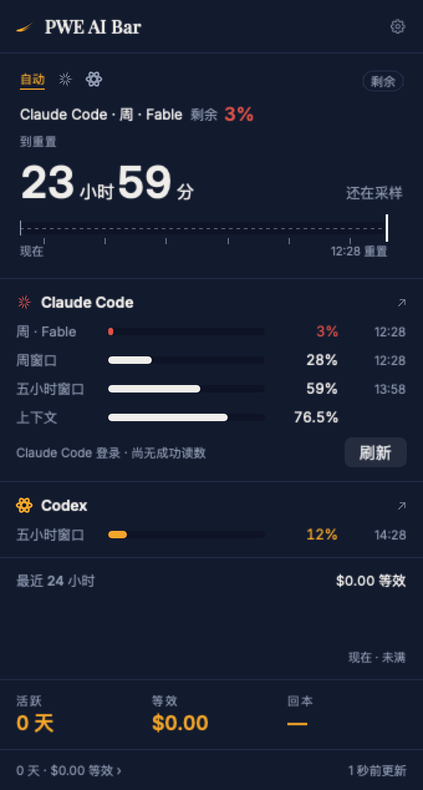
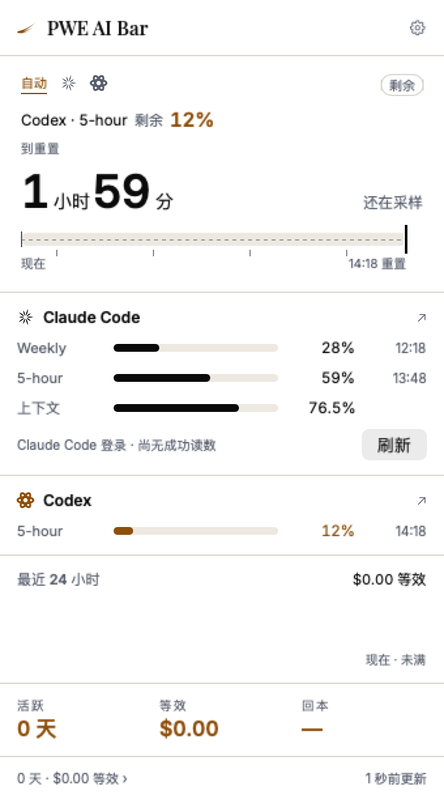

<div align="center">

# PWE AI Bar

**你所有 AI 编码工具的额度，收进菜单栏那 22 点。**
但它的本职是在该你出手的那一刻找到你。

[](https://github.com/kenshinice-ai/pwe-ai-bar/releases/latest)
[](#装)
[](#装)
[](LICENSE)

*A PARADISE PRODUCTION · 天域文创出品*

[English](README.md) · **简体中文**


 

<sub>中英双语，跟随系统或在应用内切换。</sub>

</div>

---

## 装

```bash
brew install --cask kenshinice-ai/tap/pwe-ai-bar
```

或者从 [pwestudio.site/aibar](https://pwestudio.site/aibar) 下载 `.dmg`。
两者是同一个文件，已由 Apple 签名并公证 —— **打开不会有安全提示**，
不需要右键「打开」，也不用去隐私设置里放行。如果你手上那份会弹警告，那份不是我们发的。

需要 **macOS 13 或更新版本，Apple Silicon 机型**。没有 Intel 版本。

**界面中英双语**，设置里可切换。默认跟随系统 —— 但跟随系统未必对：
很多人是有意把 macOS 设成英文的，只跟随系统他们就永远看不到中文界面，所以两个选项都在。

已经登录 Claude Code 的话，应用直接复用那个登录 —— 不用重新输账号，也不会弹钥匙串授权框。
为什么不用，见下面「它不问你要密码」。

---

## 它做什么

### 看板

- **Claude Code** 五小时与周窗口的真实百分比，来自 `/api/oauth/usage`；模型独立额度分开列
- **Codex** 额度，读它自己的 app server，零凭据
- 当前会话的上下文占用
- 另外五家只读接入（见下表）
- **战绩页**：按 API 目录价折算的等效成本、按档位算的回本倍数、模型与日期分布，日期区间可调

### 续航仪

面板最上面是倒计时条，下面那个最大的数字只回答一个问题：**按这个节奏，到不到得了重置。**

每一条读数都是整数，长时间的平台期是常态。误差不是可以抹平的高斯噪声，是量化 ——
所以这里没有回归、没有 EWMA、也没有卡尔曼，它们都在平均一个不存在的 ε。
取而代之的是两条界，跨度 *S* 小时：

```
rate.low  = max(0, Δp − 1) / S
rate.high = (Δp + 1) / S
```

一个式子，三个想要的性质。平台期只给上界，于是有续航的**下**界 ——
可以说「至少还能跑这么久」，并且这句话是真的。单级跳的下界必为零，
于是一步永远不能宣布你会用尽。爆发随 *S* 增长自行衰减。
不确定性的出口就是区间的宽度，不需要另设置信度参数。判决共七种，各有颜色档。

完整规格：[docs/FORECAST_ENGINE_SPEC_2026-09-06.md](docs/FORECAST_ENGINE_SPEC_2026-09-06.md)

### 哨兵

看板那部分市面上已有十几个实现。真正值得为之装一个东西的是这部分：

- **额度重置了** —— 到点主动告诉你可以继续干活
- **Claude 在等你回话** —— 权限确认卡住时，菜单栏让位、通知弹出
- **离座推手机** —— 超过五分钟没碰键盘，提醒转发到 ntfy / Bark

会话事件需要装 hook：**设置 → 会话事件 → 安装**。三个钩子以合并方式写进
`~/.claude/settings.json`，**不覆盖你已有的配置**，动手之前先校验并留一份逐字节备份；
配置损坏、不可读或是符号链接时停止安装。重复安装不会重复添加。

| 钩子 | 作用 |
|---|---|
| `Notification` | Claude 停下来等你 → 菜单栏让位、通知弹出 |
| `UserPromptSubmit` | 你回复了 → 立刻清掉等待状态，而不是等这一轮结束 |
| `Stop` | 任务完成 → 离座时才提醒 |

`UserPromptSubmit` 不记录任何文本 —— 它的载荷就是你刚敲进去的东西，
而这个事件只需要终结等待状态。

---

## 它不问你要密码

macOS 的钥匙串授权是按「条目 × 程序」给的。Claude Code 用 `/usr/bin/security` 创建自己的登录记录，
所以这条记录认这个工具 —— 而本应用正是通过同一个工具、用 Claude Code 自己用的那条命令去读。
**于是全程静默**：不弹框、不需要「始终允许」，升级之后、Claude Code 重新登录之后也不用再授权。
代价是一次约 20ms 的子进程，而且只在记录被写过、或距上次读取超过五分钟时才跑。

**它只读。** 应用从不续期这个登录，也从不写这条记录。1.4.0 及更早的版本两件都做，而且真付出过代价：
2026 年 9 月 8 日，某台机器上三次续期写不回去，那台机器的 CLI 只能重新登录。只读的代价写在下面「装之前先看」。

令牌只发往 `api.anthropic.com`，不去别处。**没有统计、没有崩溃上报、不需要任何账号。**

诊断命令一律不打印令牌、账号标识或服务器正文：

| 命令 | 用途 |
|---|---|
| `--cred` | 只显示配置说明 |
| `--credentials` | 只读查询额度，并打印 Claude Code 最近一次写入登录的时间和登录到期时间 |
| `--credprobe` | 用 security 工具读一次 Claude Code 的登录，打印耗时 |
| `--popover` | 打开真实面板并打印它的几何 |

---

## 八家为什么不一样

| | 怎么读 | 要授权吗 |
|---|---|---|
| **Claude Code** | `api.anthropic.com/api/oauth/usage`，凭据按 CLI 写进去的方式从钥匙串读回来 | 不要 |
| **Codex** | `codex app-server` 的 `account/rateLimits/read`；读不到就退回 rollout 日志 | 不要 |
| **Cursor** | 编辑器自己的 `state.vscdb`，Connect RPC 问 `api2.cursor.sh` | 不要 |
| **GitHub Copilot** | 插件配置 → `gh` 的 hosts.yml → `gh` 的钥匙串条目，问 `copilot_internal/user` | 不要 |
| **Devin** | `~/.local/share/devin/credentials.toml`，问 `server.codeium.com` | 不要 |
| **Grok** | `~/.grok/auth.json`，问 `cli-chat-proxy.grok.com` | 不要 |
| **Antigravity** | 钥匙串里 Google 的 OAuth 文档，问 Cloud Code | 不要 |
| **Gemini** | **读不到。** 桌面版只有 settings 数据库，没有任何额度字段；CLI 那个 `gemini_cli.token.usage` 是 token 计数不是额度 | — |

不是我们对八家用了八种办法，是八家各自决定了往本地写什么。

三条规矩对所有 provider 一致：

- **只读。** 不刷新任何令牌、不写任何凭据文件。别人的登录状态归他们自己管，
  这个 app 能做的最糟的事，就是把某人的 session 转到一半，让他在正干活的工具里被登出。
- **不请自来的事一件不做。** 找不到凭据就是没装，不发请求。钥匙串更严：
  只有这台机器上装了那个 app 才会去问它的条目 —— 去问一个没装的工具，等于凭空制造一次密码提示。
- **有界。** 每个子进程有截止时间，每个请求有超时，一家慢不拖累其余的（并行，不是排队）。

**默认只开 Claude Code 和 Codex。** 另外五家在设置里列着、显示检测到没有，
但要你自己打开 —— 打开就等于把本机找到的凭据发给一个你没让我们联系的厂商。
这个 app 别的权限都是等人给而不是默认拿，出站请求带着令牌不该是那个例外。

---

## 装之前先看

写在这里，比让你自己发现要好。

- **真正验证过的是 Claude Code 和 Codex 两家。** 另外五家 —— Cursor、Copilot、Devin、
  Grok、Antigravity —— 从未在真实账户上验证过，因为开发机上一个都没装。
  它们全部只读、以「装没装」为前提、并且有超时；但「应该能用」不等于「能用」。
  三处口径是反的（Devin 与 Antigravity 报**剩余**，Cursor 与 Grok 报**已用**），测试专门盯这一条。
- **它读你的 Claude Code 登录，但从不续期。** 以前应用会自己续期过期的令牌并写回；
  1.5.0 起续期交给 Claude Code —— 只有它存得下自己换来的新令牌。代价是：如果你有一阵子没用 Claude Code、
  登录已经过期，额度会停住。面板会说明原因，并给一个「打开 Claude Code」按钮 —— 用它一下，登录就会续期，
  额度随后自动恢复。
- **订阅价格默认取表内值。** Pro 与 Max 的月费写在 `pricing.json` 里，
  按凭据里的档位取用；**设置里可以改，支持美元与澳元**。识别不出档位时，
  页面显示等效成本但**不显示回本倍数** —— 一个建立在没人核实过的价格上的比值，
  读起来和正确的比值一样自信。

---

## 从源码构建

无第三方依赖。

```bash
swift test                      # 185 个
./scripts/build-app.sh          # 组装并签名到 build/PWE AI Bar.app
open "build/PWE AI Bar.app"
```

本机构建是 ad-hoc 或 Apple Development 签名，只能在本机跑；
分发用的 Developer ID 签名与公证在发版机上完成。

要动代码请先读 **[docs/HANDOFF.md](docs/HANDOFF.md)** —— 里面写了三处不显然的机制
（为什么不弹钥匙串框、为什么对 Claude Code 的登录只读不续期、为什么速率是区间），
以及每一条「上一版为什么错」。设计方案全文在 [docs/design.html](docs/design.html)。

---

## 许可

源码按 [MIT](LICENSE) 授权 —— 这个 app 会读你的凭据，所以你应该能亲眼确认它拿这些凭据
做了什么，并且能自己构建一份来核对。

**品牌不在授权范围内**：名称、翼形标识与其向量数据、应用图标、以及那句 slogan。
你可以 fork、修改、再分发，但再分发的构建不能带着翼标、也不能用 PWE 或
Paradise Production 的名字让人以为那是官方版本 —— 把 `Sources/PWEAIBar/Brand/`
和应用名换成你自己的。

PWE Studio 菜单栏家族的第四位，接在 Loan Bar、Lumen Bar、MAC MONITOR 之后 ——
全部在 [pwestudio.site](https://pwestudio.site)。

A Paradise Production · 天域文创出品
