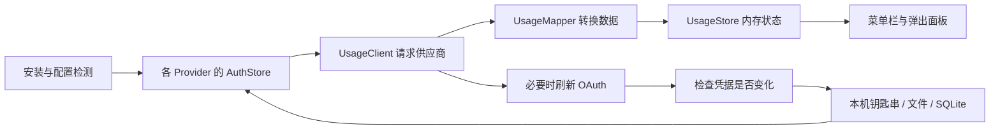

# AI Usage Menubar 技术研究与 PWE AI Bar 实现方案

研究日期：2026-09-05。交付范围：源码研究、现有项目对照、实现方案；本轮不修改应用代码。

研究对象：[burakgon/ai-usage-menubar](https://github.com/burakgon/ai-usage-menubar)。本文以实际下载的提交 `3df27e9081192bc5c954f932e4e807e097a49c02` 为准，提交说明为 `Release AI Usage 0.2.1`，提交日期为 2026-07-29。下文上游源码链接均固定到该提交；官方在线文档为研究当天读取的版本。

## 1. 核心结论

**它能做到的是“复用已经登录的官方工具，通常无需再次输入账户密码”。它仍然需要有效的登录凭据，也没有一个可以查询所有 AI 余额的通用接口。**

基本流程是：

1. 检查本机安装了哪些支持的工具。
2. 从这些工具的钥匙串条目、凭据文件或状态数据库取得已有登录凭据。
3. 直接向对应供应商请求额度数据。
4. 把不同格式转成统一的窗口、剩余百分比、重置时间和可选账务读数。
5. 定时刷新；必要时使用 refresh token 续期，并写回原凭据来源。

Claude 和 Codex 的主路径都不需要读取浏览器密码或浏览器 Cookie，也不需要用户另外购买开发者 API Key。前提是本机存在能访问相应订阅额度的登录态。源码中的 `client_id` 是客户端标识，不是能访问任意账户的万能密钥。证据：[Claude 请求实现][S3]、[Codex 请求实现][S6]。

三个容易混淆的概念必须分开：

| 问题 | 实际答案 |
| --- | --- |
| 不输入 Claude/OpenAI 账户密码？ | 已经通过官方工具登录且凭据有效时，通常可以 |
| 完全不读取敏感凭据？ | 不可以这样描述；直连接口路线会读取 access token，续期还需要 refresh token |
| 保证没有 macOS 授权弹窗？ | 源码不能保证，取决于钥匙串访问控制、锁定状态和安装环境 |
| 能读所有 AI 的钱？ | 不能；该版本实现了七个工具的专用适配器，主要读取额度，部分提供账务字段 |
| 完全只读？ | 不是；上游自动续期会写回凭据，且 Antigravity 另有私有令牌缓存 |

## 2. 截图到底展示什么

截图只能证明某次运行中 Claude、Codex 显示了读数，不能证明另外五家已经登录或完成过真实请求。第二张图中的 `Not Installed` 是安装检测状态，不等于“该供应商没有额度”。

### 2.1 百分比是订阅限额，不是美元余额

- Claude `Session` 对应短期使用窗口，`Weekly` 对应周窗口。
- Codex 同样存在不同长度的限制窗口；不能只看 primary/secondary 名称推定时长。
- 截图选择 `Left`：Claude 93% left 对应已用 7%；Codex 48% left 对应已用 52%。
- `Reset 4h 46m` 是从供应商给出的重置时间减去当前时间得到的倒计时。
- 这些百分比通常不能换算成确定的剩余 token 数、剩余对话次数或可退现金。

上游内部保留已用百分比，剩余显示为 `min(100, max(0, 100 - used))`。原始已用百分比与进度条绘制分开处理。证据：[显示模型][S9]。

### 2.2 截图中的 Codex USD 是派生值

该提交的 `CodexUsageMapper` 读取 `credits.balance`，或在 `has_credits == false` 时使用 0，最后才回退到 `x-codex-credits-balance` 响应头。随后将 credits 向下取整，按代码中的常量 `0.04 USD/credit` 计算美元显示。

因此截图里的 `USD 0.00 · 0 credits left`，可能来自明确的零 credits 或 `has_credits=false`，并不表示程序读取到了整个 OpenAI API 平台的钱包余额。**0.04 是此版本的实现假设，本文没有验证它是今天所有套餐的通用兑换规则。PWE 首版应显示接口原始 credits，不照搬美元换算。** 证据：[Codex 额度与 credits 映射][S7]。

Claude 的 `extra_usage` 又是另一种数据：上游将 `used_credits`、`monthly_limit` 按美分除以 100，显示额外消费与月预算；不是订阅剩余百分比，也不是可提现余额。该单位判断来自上游映射，接入时仍需脱敏真实响应与官方页面对照。证据：[Claude 额度与消费映射][S4]。

## 3. 上游总体架构



每个供应商基本分成四层：

| 层 | 职责 | Claude 示例 |
| --- | --- | --- |
| AuthStore | 寻找、解析和保存凭据 | `ClaudeAuthStore.swift` |
| UsageClient | 构造用量请求、token 刷新请求 | `ClaudeUsageClient.swift` |
| UsageMapper | 将供应商 JSON 映射为窗口与账务读数 | `ClaudeUsageMapper.swift` |
| Provider actor | 串起鉴权、请求、重试、并发状态 | `ClaudeProvider.swift` |

`UsageStore` 通过 task group 请求已安装且开启 Track 的供应商，保存每家的 snapshot 和 failure。Track 决定是否查询；Menu Bar 决定是否显示在菜单栏，两者独立。默认五分钟刷新，可选 1/5/15/30/60 分钟；正常无请求时主要等待定时任务。这里的并行是应用运行时行为，不是本次研究使用了多个代理。证据：[UsageStore][S8]、[偏好设置][S10]。

网络层使用 ephemeral `URLSession`，关闭 URL 缓存与 Cookie 存储，请求超时 20 秒、资源超时 30 秒。成功额度只保存在内存，临时失败保留旧值并标 stale，认证或存储失败清除对应 snapshot。这里的“额度不落盘”不等于“凭据不落盘”。证据：[HTTPClient][S11]、[状态模型][S9]。

工程使用 SwiftUI + AppKit，Swift 6，最低 macOS 26。`ENABLE_APP_SANDBOX=NO`；Release 开启 Hardened Runtime。读取其他工具数据依赖这种桌面应用运行环境，不能把相同代码直接移进浏览器前端，也不能假定沙盒版会获得同样文件访问能力。PWE 不需要为了采用数据层而升级到 macOS 26。证据：[工程配置][S12]。

## 4. Claude：如何免重新输入密码读取额度

### 4.1 凭据来源与优先级

`ClaudeAuthStore.loadCandidates()` 先取一个可解析的钥匙串候选，再取文件候选。Provider 对认证失败的候选允许继续尝试下一来源。

钥匙串查找顺序：

1. 如果设置了 `CLAUDE_CONFIG_DIR`，先尝试 `Claude Code-credentials-<hash8>`。
2. 然后尝试默认 service `Claude Code-credentials`。
3. 每个 service 先用当前用户 account 精确读取，再兼容只按 service 读取的旧格式。
4. 文件候选是 `$CLAUDE_CONFIG_DIR/.credentials.json`；没有覆盖目录时是 `~/.claude/.credentials.json`。

上游的 hash8 是目录字符串经 Unicode canonical composition 后的 SHA-256 前八位小写十六进制；这段代码不是“先解析符号链接得到真实路径再 hash”。兼容路径时应照实际 CLI 的规则，而不是自行规范化后改变查找 key。证据：[ClaudeAuthStore][S2]。

Claude 官方文档也确认 macOS 使用钥匙串、写入失败时可使用权限为 0600 的凭据文件，且 `CLAUDE_CONFIG_DIR` 会影响文件与钥匙串来源。[Claude 官方认证文档][O1]

### 4.2 最关键的一层：它调用 `/usr/bin/security`

上游 `SecurityKeychainAccessor` 没有直接从应用进程调用 `SecItemCopyMatching` 读取共享项，而是用 Foundation `Process` 启动 `/usr/bin/security`，传入参数数组：

```swift
// 展示上游调用形态；stdout 必须由父进程私有捕获，不能打印到日志。
executable = "/usr/bin/security"
arguments = [
    "find-generic-password",
    "-a", currentUser,
    "-s", "Claude Code-credentials",
    "-w"
]
```

`-w` 表示把条目的秘密内容返回到子进程 stdout。条目虽然叫 generic password，里面实际可能是一份 OAuth JSON，并不意味着取出了用户的 Claude 登录密码。

**为什么这可能少弹一次框？** macOS 传统钥匙串的 ACL 按操作和受信任程序决定是否允许访问。如果该条目允许 `/usr/bin/security` 读取，系统工具可以直接返回内容；一个未被信任的新应用直接读取时可能需要确认。这是现有访问控制允许的读取，不是破解加密。[Apple ACL 文档][O2]

**证据边界：** 已确认上游调用系统工具；没有在本轮读取 Lee 的钥匙串，也没有检查该条目的实际 ACL。因此不能从源码断言“所有 Claude 版本创建的条目都信任 security”，或“任何电脑永远零弹窗”。五秒超时只限制等待，不能保证系统对话框从未出现。证据：[SystemAccess.swift][S1]。

### 4.3 它取的是完整 OAuth 状态

下面仅为字段示意，全部是合成占位值：

```json
{
  "claudeAiOauth": {
    "accessToken": "<redacted>",
    "refreshToken": "<redacted>",
    "expiresAt": 0,
    "subscriptionType": "pro",
    "rateLimitTier": "<provider tier>",
    "scopes": ["user:profile", "user:inference"]
  }
}
```

- `accessToken` 用于额度请求。
- `refreshToken` 用于登录续期，不用于 UI。
- `expiresAt` 是 epoch 毫秒，不能按秒解析。
- `subscriptionType` 与 `rateLimitTier` 用于套餐展示。
- 非空 scopes 数组必须包含 `user:profile`；缺失或空数组按权限未知处理，再由服务器判断。
- 兼容 JSON 和十六进制编码内容，编码转换不是凭据解密。

上游明确不选择 `CLAUDE_CODE_OAUTH_TOKEN`，其文档说明 `setup-token` 令牌不具备该用量接口所需的 profile scope。**不能以“令牌长期有效”推导“可以读取额度”**；手动输入的令牌也需要检查权限并验证接口。这个具体 scope 合约来自上游研究与代码，不是官方承诺的第三方额度 API。证据：[上游合约][S0]、[scope 校验][S2]。

### 4.4 实际请求与映射

```http
GET https://api.anthropic.com/api/oauth/usage
Authorization: Bearer <access token>
Accept: application/json
anthropic-beta: oauth-2025-04-20
User-Agent: claude-code/2.1.69
```

上述 User-Agent 是上游写死的兼容值，不能据此声称任意 429 都是 User-Agent 错误，更不能承诺伪装相同字符串就不会限流。接口与头部应集中管理并通过真实兼容性验证。证据：[ClaudeUsageClient][S3]。

| 返回字段 | 用法 |
| --- | --- |
| `five_hour.utilization` | Session 已用百分比 |
| `seven_day.utilization` | Weekly 已用百分比 |
| `seven_day_sonnet.utilization` | Sonnet 独立窗口，存在才展示 |
| `limits[]` 中 weekly_scoped 且模型名为 Fable 的 `percent` | 此提交支持的额外模型窗口 |
| 各窗口 `resets_at` | 重置时间 |
| `extra_usage` | 可选额外消费，不与订阅百分比混算 |

上游日期解析兼容 ISO-8601、不同小数秒、缺少时区时按 UTC，以及 epoch 秒/毫秒。Fable 等名称仅描述该提交的匹配逻辑，不代表所有账户都有此项。证据：[ClaudeUsageMapper][S4]。

### 4.5 自动续期与错误处理

距 `expiresAt` 不超过五分钟且有 refresh token 时，上游先续期：

```http
POST https://platform.claude.com/v1/oauth/token
Content-Type: application/json

{
  "grant_type": "refresh_token",
  "refresh_token": "<redacted>",
  "client_id": "9d1c250a-e61b-44d9-88ed-5944d1962f5e",
  "scope": "user:profile user:inference user:sessions:claude_code user:mcp_servers user:file_upload"
}
```

刷新 scope 字符串不能凭空给令牌增加未授予的权限；成功与否仍由服务端决定。

请求返回 401/403 后，另有一次续期并重试用量请求的分支；仍失败就要求重新登录。`invalid_grant` 被视为登录失效。注意“401 后一次重试”不等于整次 fetch 最多续期一次：此前可能已经做过到期前续期。

429 设置冷却时间，支持 `Retry-After` 秒数或 HTTP 日期，缺失时回退五分钟。Claude Provider 在后续请求前检查冷却，手动刷新也不能跳过。凭据变化后冷却会重新绑定。证据：[ClaudeProvider][S5]。

保存之前比较完整候选 generation，发布额度之前再比较一次；检测到 CLI 登录变化时最多重新加载一次。其目的是避免旧请求覆盖新登录或显示旧账户数据。它是变化检测，**不是与官方 CLI 共享的一把跨进程锁**。

## 5. Codex：实时读取而非只看历史日志

### 5.1 上游寻找凭据的方式

`CODEX_HOME` 已设置时，仅在这个目录查 `auth.json`，然后尝试钥匙串。没有设置时依次尝试：

1. `~/.config/codex/auth.json`
2. `~/.codex/auth.json`
3. service 为 `Codex Auth` 的钥匙串条目

这份顺序属于 AI Usage 的兼容策略。OpenAI 官方默认目录是 `~/.codex`，并支持 file/keyring/auto 存储选择；不能把 `~/.config/codex` 写成官方唯一默认位置。[CodexAuthStore][S13]、[OpenAI 认证文档][O3]

凭据字段示意：

```json
{
  "tokens": {
    "access_token": "<redacted>",
    "refresh_token": "<redacted>",
    "id_token": "<redacted>",
    "account_id": "<redacted>"
  },
  "last_refresh": "<ISO-8601 timestamp>"
}
```

只有 `OPENAI_API_KEY` 而没有可用 ChatGPT access token 时，上游返回“不支持查询订阅额度”，不会把 API 计费账户当作订阅账户。代码还会在遇到 API-key-only 文件时直接终止这一查询，不再寻找其他来源。证据：[CodexProvider][S14]。

### 5.2 额度 HTTP 请求

```http
GET https://chatgpt.com/backend-api/wham/usage
Authorization: Bearer <access token>
Accept: application/json
ChatGPT-Account-Id: <account_id when present>
```

`ChatGPT-Account-Id` 用于携带凭据中的账户/工作区上下文，不能自行猜值或把不同来源的 token 与 account ID 拼在一起。这条是 ChatGPT 后端接口，不能换成 OpenAI API 平台余额接口。证据：[CodexUsageClient][S6]。

| 返回字段 | 上游用法 |
| --- | --- |
| `rate_limit.primary_window.used_percent` | 主槽位的已用比例 |
| `rate_limit.secondary_window.used_percent` | 次槽位的已用比例 |
| `limit_window_seconds` | 18000 秒归为 Session，604800 秒归为 Weekly |
| `reset_at` | epoch 秒形式的重置时间，优先使用 |
| `reset_after_seconds` | 缺少绝对时间时，相对请求映射时间计算 |
| `additional_rate_limits[]` | 查找首个名称或 metered_feature 含 spark 的条目 |
| `plan_type` | 套餐标签 |
| `credits` | 可选 credits 信息 |

窗口时长优先于槽位：周窗口即便放在 primary，也应显示为 Weekly。缺少比例时，上游允许从 `x-codex-primary-used-percent`、`x-codex-secondary-used-percent` 响应头回退。未知时长才按槽位做兼容显示。证据：[CodexUsageMapper][S7]。

PWE 新实现应保存任意窗口的真实 duration，未知时长显示“短窗口/长窗口”或具体时长，避免未来新增窗口被硬标五小时。套餐标签也不应照搬上游的 `pro → Pro 20x` 常量映射，除非已核实对应当前产品定义。

### 5.3 令牌刷新

上游解码 access token JWT 的 `exp`，提前五分钟刷新。只有无法读出 `exp` 时，才用 `last_refresh` 超过八天作为回退判断。JWT 解码只用于读取到期提示，不是本地验证 token 有权访问账户。

主动续期前重读同一个来源，优先采用官方 CLI 已经轮换的新令牌：

```http
POST https://auth.openai.com/oauth/token
Content-Type: application/x-www-form-urlencoded

grant_type=refresh_token&client_id=app_EMoamEEZ73f0CkXaXp7hrann&refresh_token=<form-encoded token>
```

响应中的新 access token、可选 refresh token、可选 ID token 和 `last_refresh` 写回原来源。保存前比较来源内容；变了就停止保存。识别 `refresh_token_expired`、`refresh_token_reused`、`refresh_token_invalidated`，分别提示过期、冲突或撤销。401/403 后也有一次刷新和一次额度重试。证据：[CodexAuthStore][S13]、[CodexProvider][S14]。

### 5.4 不应原样移植的 Codex 细节

1. **429 冷却不完整。** Codex Provider 算出 retryAt 并抛出错误，却没有 Claude 的 `rateLimitedUntil` 请求前检查；Store 也没有按 retryAt 阻止重新发起请求。正常定时器仍会等刷新周期，但手动刷新可以提前重试。PWE 应统一实现冷却。
2. **钥匙串没有精确 account 选择。** 上游只按 `Codex Auth` service 读取。OpenAI 当前开源实现的传统 keyring 路径用 `cli|<canonical CODEX_HOME 的 SHA256 前16位>` 作为 key，另有加密 secrets 存储路径。多目录与不同存储后端时，不应随便取同名 service 的第一条。[OpenAI auth storage 源码][O5]
3. **未知字段会在重编码时丢失。** `CodexAuth` 只声明部分字段，整份 Codable 重新写回不能保留以后新增的未知字段。Claude 的 typed document 有相同风险。
4. **检查后写入存在时间缝隙。** reread + compare + atomic rename 避免了一部分冲突与半写文件，不能消除 CLI 同时轮换远端 refresh token 的风险。
5. **成功结果发布前的账户检查不对称。** Claude 会重比 generation；Codex 正常 usage 成功后直接 map，未做相同最终检查。账户中途切换时，PWE 应丢弃旧世代结果。
6. **空响应可能被当作成功。** Claude/Codex mapper 可从空对象产生没有窗口的 snapshot；PWE 应区分有效的“无此额度”和结构变化/无有效指标。

以上是对该固定提交的静态代码判断，不表示已在真实账户上复现这些竞争条件。证据：[Claude 凭据][S2]、[Claude 映射][S4]、[Codex 映射][S7]、[Store][S8]、[Codex 凭据][S13]、[Codex 请求流程][S14]。

## 6. 现在可采用的 Codex 官方集成路线

**建议 PWE 先验证 Codex App Server 的 `account/rateLimits/read`，再决定是否维护直连 wham 适配器。** 这是本方案新增的选择，原项目没有走这条路线。

官方文档提供 stdio、初始化握手、账户额度读取及更新通知。最小协议顺序如下，每行一个 JSON；先等 initialize 成功再继续：

```json
{"id":1,"method":"initialize","params":{"clientInfo":{"name":"pwe_ai_bar","title":"PWE AI Bar","version":"0.1.0"}}}
{"method":"initialized","params":{}}
{"id":2,"method":"account/rateLimits/read"}
```

解析时优先 `rateLimitsByLimitId`，缺失才兼容 `rateLimits`；字段包括 `usedPercent`、`windowDurationMins`、`resetsAt`。缺失 credits 保留未知。`rateLimitResetCredits` 是可用重置次数，与付费 credits 分开。依据：[OpenAI App Server 文档][O4]。

实施建议：由 Swift `Process` 启动用户已安装的 `codex app-server`，通过私有管道交换数据，不开放 TCP 端口；用请求 ID 匹配响应、限制输出大小、设置启动和请求超时，并正确结束进程。额度查询不需要创建任务或发起模型推理。

这条路线把认证和存储适配交给官方客户端，PWE 不必自己取出和保存 token。但官方客户端仍可能执行正常续期，**不能承诺磁盘登录状态绝不改变**。也不能默认其他桌面应用的登录态一定与该 CLI 选用的 home 相同。

| 路线 | 优点 | 代价与限制 | 定位 |
| --- | --- | --- | --- |
| App Server | 文档化协议，减少自管凭据与接口变化成本 | 依赖可执行程序及版本，需要量启动/常驻开销 | PWE 优先验证 |
| token + wham | 贴近原项目，无需常驻 CLI 进程 | 内部接口、凭据存储和续期由自己维护 | 独立可选适配器 |
| 本地 rollout 日志 | 无需读取鉴权凭据，可离线使用 | 只有历史观察，CLI 不运行时不会变新 | 保留为明确标注的后备数据 |

是否短任务退出还是常驻等待，先测冷启动耗时、常驻 footprint、休眠唤醒恢复，再选方案。不能引用原项目“0% CPU”宣传来证明 App Server 路线同样轻量。本轮没有启动 App Server 或查询真实账户。

## 7. 其他五家如何接入

下面是各自的独立实现，不是通过 Claude/Codex 令牌跨平台读取：

| 工具 | 本机凭据来源 | 额度请求 | 主要映射 |
| --- | --- | --- | --- |
| Cursor | `~/Library/Application Support/Cursor/User/globalStorage/state.vscdb` 中 cursorAuth 字段；钥匙串 access/refresh token | `api2.cursor.sh/aiserver.v1.DashboardService/GetCurrentPeriodUsage` 与 `GetPlanInfo`，Connect RPC | Total、Auto、API |
| Antigravity | 钥匙串 service `gemini`、account `antigravity`，解包已有登录信息 | Google Cloud Code `v1internal:retrieveUserQuotaSummary`，失败时有 model quota 路线 | Gemini/Claude 各自的额度池 |
| GitHub Copilot | editor apps/hosts JSON → `~/.config/gh/hosts.yml` → `gh:github.com` 钥匙串 | `GET https://api.github.com/copilot_internal/user`，`Authorization: token …` | Credits、Chat、Completions |
| Devin | `~/.local/share/devin/credentials.toml`，然后 Devin state.vscdb | 默认 `server.codeium.com/exa.seat_management_pb.SeatManagementService/GetUserStatus` | Daily、Weekly |
| Grok | `~/.grok/auth.json` | `cli-chat-proxy.grok.com/v1/billing?format=credits` 及 `/v1/settings` | Weekly 与计划信息 |

来源：[Cursor][S15]、[Antigravity][S16]、[Copilot][S17]、[Devin][S18]、[Grok][S19]。

补充边界：

- Cursor 并非单纯“文件永远优先”：代码对数据库 free membership 与钥匙串不同 subject 有特别分支。
- Devin 读出的字段就叫 `windsurf_api_key`/`apiKey`。不需要用户额外填写 API Key，不代表内部从未使用 key。
- Antigravity 还会把派生 access token 缓存到 AI Usage 私有文件，并绑定 refresh credential 指纹；“不保存历史额度”不适用于这份认证缓存。
- Antigravity 的 Claude pool 不等于用户 Claude.ai 订阅，两者不可合并为同一个账户余额。
- Copilot 的 editor/GitHub CLI token 仍需服务端接受，并非任何 GitHub 登录都必然具备该接口权限。
- 原项目没有 OpenRouter、Z.ai 适配；其设计也排除了只提供机器本地估算的 OpenCode 路线。[上游合约][S0]

## 8. 对照当前 PWE AI Bar：已经有的与缺少的

对照根目录：`/Users/leeliu/Documents/ClaudeProject/PWE AI Bar`。研究时 HEAD 为 `92edde19ce15b3ef1756c5eb4aae65bcc04ddf80`，但工作区有大量未提交修改，以下判断以当时实际文件内容为准，不能只从该 HEAD 重现。

| 部分 | 当前代码事实 | 方案 |
| --- | --- | --- |
| Claude 系统工具读钥匙串 | 已有 `/usr/bin/security`、当前用户优先、legacy 与文件回退 | 复用并完善错误分类，不重做 |
| Claude 配置目录与 scope | 已有 hash service、hex 解码、`user:profile` 检查 | 增加 GUI 启动环境/显式目录的兼容测试 |
| Claude 凭据选择 | `ClaudeProvider.token()` 先官方凭据，再 own token | 保持自动读取；手动 token 不能遮蔽可用官方登录 |
| Claude 在线额度 | 已请求相同 `/api/oauth/usage`，有 TTL、429 与 stale | 补全续期策略和账户世代隔离 |
| Claude 自动续期 | `Credentials.Token` 只保留 value/expiry/source；无 refresh token 续期流程 | 第一阶段等待官方 CLI 更新；第二阶段才实现可靠轮换 |
| Codex | 当前 `CodexProvider` 读取 `~/.codex/sessions` 日志 | 增加在线适配层，保留日志后备 |
| Codex 日志范围 | 最近 12 个文件，各约 4 MB 尾部；读取 codex/premium 池 | 不当作完整实时额度接口；支持配置 home |
| 状态模型 | `QuotaWindow` 已有 observedAt、isStale、gradedBy | 增加数据来源、账户与额度池标识、独立 credits 模型 |
| 当前产品功能 | 已有 hooks、提醒、战绩与品牌 UI | 本次额度接入继续复用这些模块，不重写产品 |

本地证据：[Credentials.swift](</Users/leeliu/Documents/ClaudeProject/PWE AI Bar/Sources/PWEAIBar/Providers/Credentials.swift:159>)、[ClaudeProvider.swift](</Users/leeliu/Documents/ClaudeProject/PWE AI Bar/Sources/PWEAIBar/Providers/ClaudeProvider.swift:99>)、[CodexProvider.swift](</Users/leeliu/Documents/ClaudeProject/PWE AI Bar/Sources/PWEAIBar/Providers/CodexProvider.swift:4>)、[Model.swift](</Users/leeliu/Documents/ClaudeProject/PWE AI Bar/Sources/PWEAIBar/Core/Model.swift:35>)。

### 8.1 需要同步修订的解释

当前 README 仍推荐 `claude setup-token`，并将共享钥匙串说明为直接授权路径；它没有充分反映现在已经存在的 security 子进程读取路线。`Credentials.swift` 部分注释还说 own token 优先，而真正调用处已先读官方凭据。

实施时应统一为：

> 已登录 Claude Code/Codex 时，PWE 尝试复用本机登录，无需再次输入账户密码。macOS 是否要求授权由钥匙串控制。无法访问、权限不足或登录失效时，显示具体原因与重新连接入口。

另外，当前代码中“自己的钥匙串条目绝不弹框”和“User-Agent 不对就是 429”的绝对化注释，不应进入产品承诺。旧测量与旧错误推断需要独立证据，不能从注释当作本轮验证结果。

## 9. 建议的完整实现设计

### 9.1 数据模型

保留现有 `QuotaWindow` 使用方，通过适配转换维持接口稳定；新增或扩展的字段建议如下：

```text
ProviderSnapshot
  provider
  accountFingerprint       // 本机用途，不展示 token 或完整账号标识
  source                   // liveHTTP / codexAppServer / localLog
  fetchedAt                // 本次取得快照的时间
  observedAt               // 数据实际观察时间，日志绝不能写成 now
  planLabel?
  windows[]
    bucketID               // codex、附加池、模型专属池等
    windowID
    durationSeconds?
    usedPercent?           // nil 与 0 区分
    resetsAt?
    serverLimitState?
  billing?
    creditsBalance?        // Decimal；保留小数，不擅自取整
    unlimited?             // 与 0 / unknown 分开
    spendAmount?
    budgetAmount?
    currency?
  freshness                // fresh / stale / awaitingResetConfirmation
```

认证状态单独建模：`notInstalled`、`signedOut`、`accessDenied`、`unsupportedAuth`、`insufficientScope`、`expired`、`connected`。网络、限流、响应结构变化再独立作为 fetch 状态，避免离线时误导用户重新登录。

没有字段时显示 `—`、不适用或未知；不能生成 0% 已用、100% 剩余或 USD 0.00。API 429 的请求限流也不能直接显示为用户订阅额度耗尽。

### 9.2 凭据与网络边界

- 只在用户开启相应 Provider 后查其必要来源；敏感值只留在认证层。
- 读取使用固定可执行文件与参数数组，私有捕获输出。诊断只记录来源类型、耗时、状态码和错误分类，不记录 token、完整 auth JSON 或响应头。
- 第一阶段不由 PWE 写共享凭据。Claude 在 access token 失效后重读来源；没有更新就显示需要官方客户端刷新/重新登录。
- Codex 优先通过 App Server；HTTP 直连作为独立可选后端，不与官方进程同时刷新同一份令牌。
- HTTP 使用 ephemeral session；只允许供应商预定 origin。跨 origin 重定向不携带 Authorization 或账户头。
- 所有子进程有超时、取消、输出上限，并离开主线程执行。
- 显式保存所选目录，处理 Finder 启动不继承 shell 变量的情况；若采用上游 login-shell 捕获，限制变量到必要白名单并缓存。
- 不为省一次提示而修改原条目的 ACL、放宽文件权限或要求 Full Disk Access。

### 9.3 第二阶段的 token rotation

若要做到 Claude 官方 CLI 长期不运行时也能自动续期，必须落实这些步骤，不能只加一个 POST：

1. 保存 credential source 的精确定位：文件路径，或 service + account；保留完整原始 JSON。
2. 进入单个 Provider 的 single-flight 刷新任务；Swift actor 本身可在 await 期间重入，不能单靠 actor 声称请求不会重叠。
3. 请求前重读凭据；有新世代就采用官方客户端的新值。
4. 每轮限制续期与重试次数，分别处理撤销、scope 不足、网络和限流。
5. 仅更新已知 token 字段，保留所有未知字段；本机权限 0600，临时文件 fsync 后原子替换。
6. 写之前再次比较；变化时放弃覆盖并重新读取，不把旧响应发布到 UI。
7. 钥匙串写回不能直接照搬 `security ... -w <token JSON>`，该方式把秘密放入进程参数。选择可控的 Keychain API 写入，并验证访问权限与原条目属性保留行为。
8. 没有与 CLI 共享的锁协议时，明确承认无法保证跨进程轮换无冲突；遇到 reused/invalidated 停止重试，恢复官方登录。
9. 如果不能可靠写回，关闭 PWE 主动 rotation；使用官方客户端管理续期。避免“远端 token 已轮换，本地仍持有旧 refresh token”的半成功状态。

上游已经有原来源写回、候选比较与私有原子文件替换，值得借鉴；但第 5、7、8 项不能据此认为已经完整解决。[SystemAccess][S1]、[ClaudeProvider][S5]、[CodexProvider][S14]

### 9.4 刷新、后备数据与账户切换

- 在线默认五分钟刷新；手动刷新做短时去重；两家统一遵守 Retry-After。
- 断网、5xx、解析失败：保留同账户 last-good，显式显示读数时间与 stale。
- 账户变化或明确登出：清除该账户快照，不把历史余额显示成新账户余额。
- 有磁盘 cache 时，必须绑定账户与来源；无凭据确认时不按 fresh 展示。额度 cache 与战绩统计 cache 分开处理。
- 在线和日志读数不跨不同账户或不同池拼接。只有能确认上下文一致时才自动后备，否则单列“本机历史读数，账户未确认”。
- 倒计时到零只触发一次新请求；没有新观测不能自动将剩余写成 100%，也不能触发“额度恢复”提醒。
- hooks 的独立响应循环保持不变，不能被网络或钥匙串阻塞。
- 各 provider 独立提交刷新结果，一个供应商缓慢不阻塞其他供应商显示。

## 10. 文件落点与执行顺序

下列均为下一轮实施建议，文件尚未由本报告创建。

| 阶段 | 文件/模块 | 工作 | 验收结果 |
| --- | --- | --- | --- |
| P0-A | 现有 `Credentials.swift`、`ClaudeProvider.swift`、README、Settings | 整理真实凭据优先级、scope、错误状态与产品说明 | 已登录用户自动连接；失效/拒绝有明确状态；不推荐无法读额度的 setup token |
| P0-B | 新 `CodexAppServerClient.swift`、`CodexLiveProvider.swift` | 有界 stdio、握手、读取并转换窗口与 credits | 不发起模型任务，获得账户在线读数；失败可解释 |
| P0-C | `CodexProvider.swift`、`Store.swift`、`Model.swift` | 在线与历史数据仲裁、来源/账户/窗口身份、credits 类型 | UI 显示真实来源；未知与 0 分开；账户切换不串值 |
| P0-D | `PanelView.swift`、`SettingsView.swift`、`RuleEngine.swift` | 窗口、重置、stale、独立 credits 和连接状态 | 核心面板可用；旧 hooks/通知规则无回归 |
| P1-A | 新或拆分 `ClaudeAuthStore.swift`、`ClaudeUsageClient.swift` | 完整 refresh 状态与可靠保存；不满足写回条件则保持官方续期 | 过期/冲突/撤销/写入失败均有正确恢复 |
| P1-B | 可选 `CodexHTTPAuthStore.swift`、`CodexHTTPUsageClient.swift` | 独立 wham 后端；按当前官方存储选择精确定位 | 与 App Server 在同账户同时间读数一致，避免同时 rotation |
| P1-C | Provider 目录 | 逐家扩展其他工具 | 每家独立真实验收，不以“有配置项”宣称支持完成 |

若 P0-B 暴露 App Server 版本或性能不适配，先完成直接 HTTP 的有效-token 只读版本；到期时依赖官方客户端更新，仍可交付一个边界明确的在线额度版本。不要为等待七家兼容而推迟 Claude/Codex 主路径。

实施开始先重读实际工作区与 Git diff。本轮发现的未提交代码必须保留和协调，不按本报告的旧行号直接覆盖。

## 11. 测试与验收清单

### 11.1 隔离测试：不触碰真实凭据

复用项目 `Tests/PWEAIBarTests/`，注入文件系统、Keychain 操作、时钟、网络与进程 transport。

| 测试场景 | 必须满足 |
| --- | --- |
| 无安装、无凭据、拒绝访问、文件损坏 | 状态能区分；不会伪造已连接/零余额 |
| Claude 默认与自定义目录 | 当前用户 service、legacy、file 顺序正确；支持 hex |
| scopes 缺失/空/有 profile/无 profile | 前三类允许服务端验证；明确无 profile 拒绝用量查询 |
| Codex API-key-only | 不冒充订阅额度查询成功 |
| Codex 主次窗口位置互换 | 按真实 duration 分类 |
| 部分字段缺失、字符串数值、NaN/Inf/布尔值 | 无效值不进入百分比或账务计算 |
| credits null/0/小数/unlimited | 语义不同，不硬算美元 |
| App Server 分片输出、通知穿插、异常退出 | 请求 ID 匹配正确；有界读取与超时；不遗留进程 |
| 401、403、invalid_grant、reused | 有界重试；不陷入刷新循环 |
| 429 秒数/HTTP 日期/无头 | 定时和手动刷新均执行冷却 |
| 使用请求中途切换账户 | 旧响应不发布，新旧数据不混合 |
| CLI 同时轮换、未知 JSON 字段 | 不覆盖新凭据，不丢未知字段 |
| 暂时离线、5xx、响应结构变化 | 同账户旧快照 stale；显示原始观察时间 |
| 重置时间已过但没有新读数 | 显示待确认，不发恢复提醒 |
| 网络或凭据读取挂起 | 菜单可打开，hooks 仍及时处理 |

### 11.2 真实验收：需要实际运行，不能由 fixture 代替

1. 使用已登录的 Claude Code 与 Codex，分别与各自官方额度界面对照，同一账户、尽量同一分钟采样。
2. 检查短期/周窗口、重置时间、套餐、额外额度来源，记录差异而不是只检查请求 200。
3. 真实观察首次连接是否有系统提示；覆盖钥匙串锁定/拒绝和重新启动，不把单机静默推广为全平台保证。
4. 覆盖 CLI 不运行、休眠唤醒、令牌过期、切换账户、离线后恢复。
5. 检查小数/长标签/无额度/credits 未知的面板，确认 Left/Used、键盘与设置开关工作。
6. 测量查询期间与空闲时资源占用；App Server 额外进程计入总量。
7. 只有通过实际账号对照的 provider 才标“已验证支持”。

下一轮实施的基础命令，**本轮没有运行这些 build/test 命令**：

```bash
cd "/Users/leeliu/Documents/ClaudeProject/PWE AI Bar"
git status --short
swift test
./scripts/build-app.sh
open "build/PWE AI Bar.app"
```

对照上游测试的方法：

```bash
xcodebuild test -project AIUsage.xcodeproj -scheme AIUsage -destination 'platform=macOS'
```

该命令在上游目录运行；本轮只阅读测试源代码，发现其覆盖 scope、凭据来源、401 刷新、Claude 429 冷却、窗口归类、credits 与 stale 等，不能写成“上游测试已跑通”。[上游测试目录][S20]

## 12. 本轮验证记录与交付边界

- 已下载指定公开仓库至 `/private/tmp/ai-usage-menubar-research-20260905`，使用 `git rev-parse HEAD` 和 `git log -1` 固定版本。
- 默认网络环境首次 clone 因 DNS 失败；获准使用网络后下载成功。该环境错误不是仓库缺陷。
- 已逐层阅读 Claude/Codex 的 AuthStore、UsageClient、Provider、Mapper，检查系统读取、HTTP、Store、工程配置与相关测试；其他五家核对凭据与请求实现。
- 已读取 OpenAI、Claude、Apple 官方资料；OpenAI `main` 的 auth storage 仅作为当天兼容性参考，未固定其 commit，不把它当作用户本机版本。
- 已对照 PWE 当前实际代码与 README，并检查工作区状态。本轮没有读用户 token、钥匙串秘密、浏览器数据或真实消费记录，没有刷新或写回官方登录。
- 本轮只新增本 Markdown；未构建/安装上游，未更改 PWE 应用代码，未运行真实 API 对照或宣称零弹窗验收完成。
- 若后续复用上游代码，应保留其 MIT 许可与 NOTICE 中相关归属；源码许可不等于供应商对内部接口兼容性的保证。[LICENSE 与 NOTICE][S21]

建议先用现有 Claude 登录读取能力加上 Codex 在线读取形成双供应商闭环，验证账户、时效与恢复，再完善 Claude 自主管理续期及其他供应商。

## 13. 源码与官方资料索引

上游链接固定到研究提交，可通过 GitHub 行号查看具体实现。

- 总体合约：[provider-contracts.md][S0]。
- Claude：[凭据发现][S2]、[请求][S3]、[映射][S4]、[续期与重试][S5]。
- Codex：[凭据发现][S13]、[请求][S6]、[映射][S7]、[续期与重试][S14]。
- 基础层：[系统访问][S1]、[HTTP][S11]、[Store][S8]、[模型][S9]、[测试][S20]。
- 官方资料：[Claude 认证][O1]、[Apple ACL][O2]、[OpenAI 认证][O3]、[App Server][O4]、[OpenAI auth storage 源码][O5]。

[S0]: https://github.com/burakgon/ai-usage-menubar/blob/3df27e9081192bc5c954f932e4e807e097a49c02/docs/provider-contracts.md
[S1]: https://github.com/burakgon/ai-usage-menubar/blob/3df27e9081192bc5c954f932e4e807e097a49c02/AIUsage/Infrastructure/SystemAccess.swift#L250
[S2]: https://github.com/burakgon/ai-usage-menubar/blob/3df27e9081192bc5c954f932e4e807e097a49c02/AIUsage/Providers/Claude/ClaudeAuthStore.swift#L78
[S3]: https://github.com/burakgon/ai-usage-menubar/blob/3df27e9081192bc5c954f932e4e807e097a49c02/AIUsage/Providers/Claude/ClaudeUsageClient.swift#L25
[S4]: https://github.com/burakgon/ai-usage-menubar/blob/3df27e9081192bc5c954f932e4e807e097a49c02/AIUsage/Providers/Claude/ClaudeUsageMapper.swift
[S5]: https://github.com/burakgon/ai-usage-menubar/blob/3df27e9081192bc5c954f932e4e807e097a49c02/AIUsage/Providers/Claude/ClaudeProvider.swift#L56
[S6]: https://github.com/burakgon/ai-usage-menubar/blob/3df27e9081192bc5c954f932e4e807e097a49c02/AIUsage/Providers/Codex/CodexUsageClient.swift
[S7]: https://github.com/burakgon/ai-usage-menubar/blob/3df27e9081192bc5c954f932e4e807e097a49c02/AIUsage/Providers/Codex/CodexUsageMapper.swift
[S8]: https://github.com/burakgon/ai-usage-menubar/blob/3df27e9081192bc5c954f932e4e807e097a49c02/AIUsage/Store/UsageStore.swift
[S9]: https://github.com/burakgon/ai-usage-menubar/blob/3df27e9081192bc5c954f932e4e807e097a49c02/AIUsage/Models/ProviderModels.swift
[S10]: https://github.com/burakgon/ai-usage-menubar/blob/3df27e9081192bc5c954f932e4e807e097a49c02/AIUsage/Store/AppPreferences.swift
[S11]: https://github.com/burakgon/ai-usage-menubar/blob/3df27e9081192bc5c954f932e4e807e097a49c02/AIUsage/Infrastructure/HTTPClient.swift
[S12]: https://github.com/burakgon/ai-usage-menubar/blob/3df27e9081192bc5c954f932e4e807e097a49c02/AIUsage.xcodeproj/project.pbxproj#L331
[S13]: https://github.com/burakgon/ai-usage-menubar/blob/3df27e9081192bc5c954f932e4e807e097a49c02/AIUsage/Providers/Codex/CodexAuthStore.swift#L64
[S14]: https://github.com/burakgon/ai-usage-menubar/blob/3df27e9081192bc5c954f932e4e807e097a49c02/AIUsage/Providers/Codex/CodexProvider.swift
[S15]: https://github.com/burakgon/ai-usage-menubar/tree/3df27e9081192bc5c954f932e4e807e097a49c02/AIUsage/Providers/Cursor
[S16]: https://github.com/burakgon/ai-usage-menubar/tree/3df27e9081192bc5c954f932e4e807e097a49c02/AIUsage/Providers/Antigravity
[S17]: https://github.com/burakgon/ai-usage-menubar/tree/3df27e9081192bc5c954f932e4e807e097a49c02/AIUsage/Providers/Copilot
[S18]: https://github.com/burakgon/ai-usage-menubar/tree/3df27e9081192bc5c954f932e4e807e097a49c02/AIUsage/Providers/Devin
[S19]: https://github.com/burakgon/ai-usage-menubar/tree/3df27e9081192bc5c954f932e4e807e097a49c02/AIUsage/Providers/Grok
[S20]: https://github.com/burakgon/ai-usage-menubar/tree/3df27e9081192bc5c954f932e4e807e097a49c02/AIUsageTests
[S21]: https://github.com/burakgon/ai-usage-menubar/blob/3df27e9081192bc5c954f932e4e807e097a49c02/NOTICE
[O1]: https://code.claude.com/docs/en/authentication#credential-management
[O2]: https://developer.apple.com/documentation/security/access-control-lists
[O3]: https://learn.chatgpt.com/docs/auth#credential-storage
[O4]: https://learn.chatgpt.com/docs/app-server
[O5]: https://github.com/openai/codex/blob/main/codex-rs/login/src/auth/storage.rs
