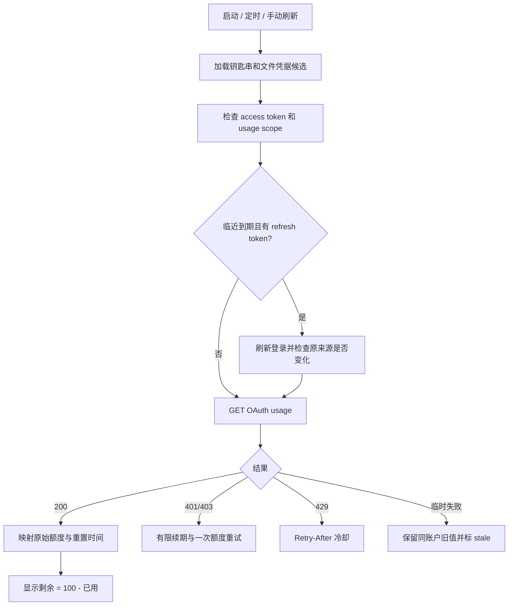

# Claude 额度精准读取：AI Usage 实现复查与推荐方案

日期：2026-09-07。范围：重新研究 AI Usage，重点解释 Claude 额度读取、实现差距和替代方式。本轮只写文档，不更改 PWE 应用、Claude 配置或登录凭据。

## 1. 我的结论

**要获得 AI Usage 那样的 Claude 额度读数，当前最直接的方案仍是复用 Claude Code 的有效登录，调用同一个 OAuth usage 接口，原样显示服务端比例。我们不缺一个更神奇的“余额接口”，主要缺少完整一致的凭据处理、字段映射和数据时效。**

AI Usage 没有根据聊天次数、token 总量、订阅价格或最近耗速估算剩余额度。它读取服务端的 `utilization`，需要显示剩余时计算 `100 - utilization`。这解释了它为什么容易与官方读数一致；它不证明服务器数据没有延迟，也不能仅凭截图判断在所有账户上都准确。

本次还找到一个值得新增的选择：**Claude 官方文档已经提供 status line 的 `rate_limits` 输出，可由官方 CLI 把额度转交给菜单栏应用。** 这能减少应用直接接触登录凭据，但依赖版本、账户和活跃会话，不适合作为目前唯一的全天候来源。

本机实际执行 `claude --version` 得到 **2.1.232**；当前官方状态栏额度示例注明需要 **2.1.251 或更高版本**。因此本机尚不满足该文档化路线的版本门槛，不能当作已经可用；本轮没有更新 Claude。[官方状态栏文档][O1]

推荐顺序：

1. **现在：完善 AI Usage 同源的 OAuth 在线读取，先把当前额度显示做好。**
2. **之后：在满足条件的新版 CLI 上验证 status line 转交，作为可选的免凭据接触模式。**
3. **最后：有明确需要时再组合两种来源；默认不引入复杂的混合仲裁。**

## 2. 本次核对的真实基线

| 项目 | 本轮证据 |
| --- | --- |
| 上游仓库 | `burakgon/ai-usage-menubar` |
| 重新获取远端 | 在已有临时 clone 执行 `git fetch origin main`，成功 |
| 上游 HEAD 与 FETCH_HEAD | 都是 `3df27e9081192bc5c954f932e4e807e097a49c02`，没有新差异 |
| 上游版本 | `Release AI Usage 0.2.1` |
| 重点源码 | ClaudeAuthStore、ClaudeUsageClient、ClaudeProvider、ClaudeUsageMapper、SystemAccess、ProviderParsing、Store、显示组件及测试 |
| Claude 四个主要文件 | 共 615 行；用户看到的操作简单，后台仍有完整鉴权和恢复逻辑 |
| 本地 PWE HEAD | `4341bfc019792a8983ecee997bfb603220be9744` |
| 本地工作区 | 已有 EnduranceView 未提交修改和四个 scratch 测试文件，本轮保留 |
| 本机 CLI | `/opt/homebrew/bin/claude`，`2.1.232` |

本次没有读取真实 access token、refresh token、钥匙串秘密或用户余额，没有调用真实 usage 接口，没有运行会写真实 hook 路径的应用测试。结论来自重新拉取的源码、官方文档和当前本机代码；具体账户兼容性仍须实际对照。

## 3. “Claude 余额”到底是什么

| 数据 | 含义 | 能否互相换算 |
| --- | --- | --- |
| 五小时/周窗口剩余百分比 | 对应订阅使用限制的剩余比例 | 不能由本地 token 数可靠倒算 |
| 模型专属额度 | 某个独立模型/范围的使用限制 | 不能与主窗口相加当总余额 |
| Extra usage | 额外消费、消费上限等账务信息 | 与订阅比例分开 |
| API 用量与费用 | Claude Console/API 组织的 token 和账务统计 | 不等于 Claude.ai Pro/Max 的剩余比例 |
| 本地 API 等效成本 | 按价格表计算“同样 token 按 API 计费会是多少” | 不等于真实已付费用或可用余额 |

AI Usage 的 Claude 卡片主要解决前三项。PWE 应首先显示“已用/剩余 + 重置 + 来源/时间”，把耗速、续航和成本估计放在独立的辅助区域。

## 4. AI Usage 的 Claude 完整调用链



### 4.1 凭据从哪里来

macOS 默认钥匙串 service 是 `Claude Code-credentials`。上游每个 service 先按当前用户 account 读取，再尝试 legacy 的 service-only 读取。若设置 `CLAUDE_CONFIG_DIR`，先查带目录 hash 后缀的 service，再查默认 service。

文件候选来自 `$CLAUDE_CONFIG_DIR/.credentials.json`；没有覆盖目录时使用 `~/.claude/.credentials.json`。`loadCandidates()` 将一个钥匙串候选和文件候选交给 Provider；认证失败可以继续尝试下一候选，并非“找到第一份 JSON 就永远只用它”。[ClaudeAuthStore][S1]、[ClaudeProvider][S3]

目录后缀是规范组合后的目录字符串 SHA-256 前八位小写十六进制。不要擅自改变路径规范化算法；CLI 升级后应以实际存储格式验证。

官方认证文档确认了 macOS 钥匙串、文件回退和自定义配置目录这一总体机制。它不保证某个第三方工具始终有静默读取权限。[Claude 认证文档][O2]

### 4.2 为什么通常不用再次输密码

上游使用 Foundation `Process` 启动系统工具，私有捕获 stdout：

```text
executable: /usr/bin/security
arguments:
  find-generic-password
  -a <current user>
  -s Claude Code-credentials
  -w
```

`-w` 返回钥匙串条目内容，这里是 OAuth JSON，不是用户的 Claude 网站密码。主应用无需自己的登录表单。是否弹系统授权框仍取决于条目 ACL、钥匙串锁定及运行环境；不能把“用了 security”写成绕过系统权限或永不弹框。[SystemAccess][S5]

只记录凭据来源、是否存在、解析结果和错误分类；不能把这个命令的真实 stdout 输出到日志、聊天或诊断报告。

### 4.3 必须保存哪些字段

上游解析 `claudeAiOauth` 内：

- `accessToken`：请求额度。
- `refreshToken`：续期。
- `expiresAt`：epoch **毫秒**。
- `scopes`：判断是否明确缺少 `user:profile`。
- `subscriptionType`、`rateLimitTier`：显示套餐。

非空 scopes 不包含 `user:profile` 时拒绝用量查询；缺少或空 scopes 只表示未知，仍需服务器验证。支持普通 JSON 和十六进制包装解析。[ClaudeAuthStore][S1]

这里最重要的是：**token 存在、token 未到期、token 有权读取 usage 是三个不同条件。**

### 4.4 `setup-token` 不应作为默认接入教程

AI Usage 明确不选用 `CLAUDE_CODE_OAUTH_TOKEN`，其研究说明 setup token 缺少读取 usage 所需的 profile scope。官方将 `setup-token` 定位为 CI/脚本的长期登录令牌；长期有效不能推出它一定支持账户额度读取。[上游合约][S0]、[CLI 文档][O3]

PWE 不应再默认要求用户生成并粘贴 setup token。若保留手动令牌作为高级兼容选项，应以实际 usage 验证决定是否可用，不依据令牌前缀、名称或本地注释中的一次成功经验作通用结论。对未知 scopes 的 token 也不能直接认定一定失败。

### 4.5 真正决定当前读数的 HTTP 请求

```http
GET https://api.anthropic.com/api/oauth/usage
Authorization: Bearer <access token>
Accept: application/json
Content-Type: application/json
anthropic-beta: oauth-2025-04-20
User-Agent: claude-code/2.1.69
```

这是上游固定提交的请求契约。`User-Agent` 是该版本的兼容值，不是万能解限流口令；只改 UA 不能解决 token 过期、scope 不足或真正的 429。[ClaudeUsageClient][S2]

域名属于 Anthropic，但这个具体 usage 路径在上游文档中被标为 undocumented endpoint。应集中封装并维护响应样本，不能宣传为长期稳定的公开第三方 API。[上游合约][S0]

### 4.6 比例如何映射

以下是合成示例，不是真实账户数据：

```json
{
  "five_hour": {"utilization": 7.4, "resets_at": "2026-09-07T12:00:00Z"},
  "seven_day": {"utilization": 18.2, "resets_at": "2026-09-12T12:00:00Z"}
}
```

得到五小时剩余 **92.6%**，周剩余 **81.8%**。没有 token 价格、速率或预测参与这个计算。

| 上游字段 | 显示 |
| --- | --- |
| `five_hour.utilization` | Session |
| `seven_day.utilization` | Weekly |
| `seven_day_sonnet.utilization` | Sonnet |
| `limits[]` 的 weekly_scoped/Fable 条目 `percent` | 此提交支持的 Fable 独立窗口 |
| 各窗口 `resets_at` | 重置时间 |
| `extra_usage` | 可选额外消费 |

原始比例保留为 Double；面板遇到非整数显示一位小数。剩余值和绘制比例有合理边界，但不会提前将领域读数整数化。数字解析拒绝 Boolean，支持有限的数字/数字字符串。[ClaudeUsageMapper][S4]、[显示格式][S7]、[ProviderParsing][S6]

日期解析支持 ISO-8601 及不同小数秒、缺少时区时按 UTC，以及 epoch 秒/毫秒。缺失字段不等于 0；没有某个模型窗口就不造一条。

Extra usage 的 `used_credits`、`monthly_limit` 在该提交按美分转换为美元。月消费限额不是账户储值余额；如显示二者差额，应叫“本期额外消费预算剩余”。其单位契约来自上游，正式接入仍需与实际官方账务界面对照。[ClaudeUsageMapper][S4]

### 4.7 为何 Claude 关闭后还能继续查询

上游自己持有 refresh token 的读取和续期流程。距到期五分钟内可主动续期：

```http
POST https://platform.claude.com/v1/oauth/token
Content-Type: application/json

{
  "grant_type": "refresh_token",
  "refresh_token": "<refresh token>",
  "client_id": "9d1c250a-e61b-44d9-88ed-5944d1962f5e",
  "scope": "user:profile user:inference user:sessions:claude_code user:mcp_servers user:file_upload"
}
```

正常 usage 返回 401/403 时另有一次刷新并重试分支。`invalid_grant` 表示登录不能继续使用。刷新 scope 字符串不会凭空扩大已授予权限。[ClaudeUsageClient][S2]、[ClaudeProvider][S3]

新 token 写回原来源，写之前比较候选 generation，发布额度之前再核对。它因此不是完全只读的程序；这也是“读一次钥匙串就结束”的简化实现不能获得同样持续可用性的原因。

需要注意：上游 typed Codable 重新编码不能保留未建模字段；reread/compare 也不是与 CLI 共享的跨进程锁。钥匙串写入把 JSON 放进 `security -w` 参数，有秘密进入进程参数的风险。PWE 应借鉴其生命周期，不机械复制这些写回细节。[ClaudeAuthStore][S1]、[SystemAccess][S5]

### 4.8 缓存与刷新为什么看起来简单

AI Usage 的额度 snapshot 只在内存保存，默认五分钟刷新；用户可手动触发。Claude 429 会记录冷却截止时间，手动刷新也不能跳过。网络/5xx/结构异常保留 last-good 并标 stale，认证或存储失败清除对应 snapshot。[UsageStore][S8]

它也不是持续推送的零延迟余额监控。简单的原因是主卡片只回答“最近成功查到多少、什么时候重置”，不让复杂预测改变余额本身。

## 5. 与当前 PWE 的实际差别

**PWE 已经调用完全相同的 OAuth usage URL。继续寻找另一个百分比公式，收益远低于修好下面这些差异。**

| 部分 | AI Usage | PWE 当前源码 | 建议 |
| --- | --- | --- | --- |
| 读取入口 | security + 钥匙串/文件候选 | 已有同类方式 | 保留现有入口，补齐可观察的来源状态 |
| 凭据候选 | 认证失败继续下一候选 | CLI 到期会试 own token；usage 返回 401/403 后直接记 rejectedValue | 以验证结果驱动候选状态，不能只按本地 expiry 选择 |
| 自动续期 | refresh token + 原来源写回 | Token 只保留 value/expiry/source，无完整 OAuth refresh | 完整版必须补生命周期；只读版明确依赖官方续期 |
| 主字段 | 先 five_hour/seven_day 标准字段 | 先解析 limits；同 channel 存在时跳过标准字段 | 对双结构的 scope/身份建立明确规则，冲突时诊断 |
| 补充字段 | Sonnet、Fable、extra usage、套餐 | 顶层只取 five_hour/seven_day；other 还会压成最紧的一条 | 标准字段补齐，独立池完整保留 |
| 重置格式 | 字符串与 epoch 数字 | 当前读取处只接受 String 后交日期解析 | 增加数值日期兼容 |
| 数值类型 | 排除 Boolean | NSNumber 读取未显式排除 Boolean | 统一严格数值解析 |
| 跨重启额度 | 不保存 | 有 version 3 quota-cache，未绑定账户身份 | 首版可改内存；若保留磁盘，绑定账户并按旧值显示 |
| 缓存与登录 | 刷新时校验凭据世代 | 有效 TTL 返回发生在重新读取凭据之前 | 账户切换后不能继续把旧账号缓存当 fresh |
| 预测 | 不介入额度映射 | 有 History/Forecast/Endurance 模块 | 额度读数与估计完全分开 |

证据：[PWE token 选择][P1]、[PWE fetch][P2]、[PWE 解析][P3]、[PWE Credentials][P4]。

当前“本地到期后尝试 own token”的补丁是有用进展，不应再说它完全没有候选回退。但仍需补 usage 验证失败后的候选处理，也不能把 own token 变成绕过 profile 权限检查的捷径。

## 6. 有更好的方式吗：四条路线比较

| 路线 | 凭据由谁管理 | Claude 不运行时 | 覆盖 | 判断 |
| --- | --- | --- | --- | --- |
| A. AI Usage 同源 OAuth 查询 | PWE 读取，完整版自行续期 | 可查询，取决于登录和接口状态 | 主窗口、部分模型池、额外消费等 | **当前推荐主路线** |
| B. 仅复用现有 access token，不主动续期 | 官方 CLI 维护，PWE 只读 | 到期后可能无法继续 | 同接口，凭据有效期间相同 | 最小只读版本，但不能承诺全天候 |
| C. 官方 status line 转交 | Claude CLI 管理，PWE 不读取 token | 没有运行会话就没有新转交 | 文档给出的有限窗口与账户类型 | **满足条件后可选，更少鉴权维护** |
| D. `/usage` UI、网页、日志/遥测 | 各不相同 | 各不相同 | UI/历史统计或不同计费领域 | 用于校验或单独统计，不作默认采集核心 |

### 6.1 新方向：官方 status line 转交

官方文档列出 `rate_limits.five_hour.used_percentage`、`seven_day.used_percentage` 和各自 epoch 秒的 `resets_at`。当前文档限定于 Pro/Max，或带 spend limit 的 Claude apps gateway；首次 API 响应后才出现，窗口可单独缺失，过 reset 会移除。额度示例要求 v2.1.251+。[官方契约][O1]

status line command 通过 stdin 接收 JSON，再把 stdout 展示在终端；事件和可配置定时器可触发执行。**脚本重新运行不等于服务端额度重新查询。** 因此本方案不会把每次脚本运行都当作一个 fresh 网络样本。

建议工程实现（这是 PWE 设计，不是官方提供的菜单栏插件）：

```text
Claude Code session
    → 官方 statusLine JSON
    → PWE 本地桥接 helper，白名单提取额度字段
    → 每会话私有文件，原子写入
    → PWE watcher 读取
    → 显示“Claude CLI 转交”，保留来源与接收时间
```

实现要点：

- 先检查版本和实际 payload 能力；本机 2.1.232 暂不能按当前文档保证支持。不要自动升级或改全局配置。
- helper 只保存额度、reset、协议版本和不暴露身份的会话标识；不整份保存 status line JSON，其中可能包含目录和其他会话信息。
- 文件落在 PWE 私有目录，目录 0700、文件 0600；每会话分开，原子替换，限制大小，损坏数据不进入 UI。
- 保存 `receivedAt`；如果源没有可信的测量时刻，`sourceObservedAt` 保持未知。重复相同 payload 不应无限延长网络 freshness 或让耗速历史积累假样本。
- CLI 停止、窗口到期或来源长时间不变时，显示旧观察/待确认，而不是剩余 100%。
- statusLine 是一个配置槽，不可直接覆盖用户原 command。桥接应让原命令收到相同 stdin，保留 stdout；安装前备份，卸载仅恢复自己仍拥有的配置版本。
- 与现有 Notification/Stop hooks 区分；它不是给现有 hook 加一个字段就会自动得到额度。
- 多会话不能仅用最新文件 mtime决定“当前账户”。无法确认相同账户/配置目录时分开显示，不合并历史。

**它更好的地方是减少 PWE 对敏感登录格式和 token rotation 的依赖；它不天然比在线接口更实时，也不覆盖所有账户。** 本轮没有得到本机实际 status line quota payload，尚属文档验证后的实施候选。

这也补充了前面研究中容易过度概括的结论：历史 transcript 中没有额度字段，不代表新版 Claude 所有本地输出都没有额度。status line 是另一条官方输出路径。

### 6.2 不建议作为主路线的办法

- **运行 `claude -p` 问“我的余额是多少”**：它是模型调用入口，不是额度查询协议；不能为读数专门发起推理。
- **`claude auth status`**：文档用途是认证状态，不是订阅剩余额度。本轮没有找到文档化的通用 `claude usage --json` 等价入口；这不等于证明任何版本都不存在隐藏命令。[CLI reference][O3]
- **自动打开并抓取 `/usage`**：适合人工对照。作为程序后端要处理交互终端和 UI 变化，维护负担更大。[Commands][O4]
- **网页 Cookie/页面抓取**：会额外引入网页登录态、浏览器保护与 DOM 变化；没有证据表明它能比同源 usage 请求更准确。
- **OpenTelemetry token 统计**：适合分析成本和活动，不能由 token 数可靠恢复订阅窗口百分比。[Monitoring][O5]
- **Usage & Cost Admin API**：面向组织 API 历史用量和账务，需要相应管理凭据，不是个人 Pro/Max 订阅余额的免登录替代。[Usage and Cost API][O6]

## 7. 推荐的最小完整实现

目标先收窄为：**Claude 五小时、周额度与重置时间可靠显示；使用已有登录；断网、过期、换账户不说错数。** 不要求先完成所有 AI 或复杂预测。

### 7.1 四层结构

| 文件/职责 | 要做的事情 |
| --- | --- |
| ClaudeCredentialStore | 发现候选、精确定位来源、解析完整 OAuth 文档；不把错误全部变成 nil |
| ClaudeUsageClient | GET usage 与可选 refresh；统一超时、重定向和头部处理 |
| ClaudeUsageMapper | 纯函数映射窗口、reset、可选 extra usage；无 UI 和估计逻辑 |
| ClaudeQuotaCoordinator | single-flight、候选验证、refresh、冷却、账户世代与 last-good |

可在现有文件中逐步拆分，不需要再建一个并行维护的 Claude Provider 系统。HTTP 层沿用 Foundation，不为此增加大型依赖。

### 7.2 用一个明确状态代替零散判断

```text
ClaudeQuotaState
  accountKey? / credentialGeneration
  source: oauthHTTP | statusLine
  status: loading | connected | stale | signedOut | denied | rateLimited | invalidResponse
  lastAttemptAt?
  lastSuccessAt?
  nextAllowedFetchAt?
  snapshot?
    windows[] { id, scope, usedPercent, resetsAt }
    extraSpend?
    planLabel?
```

读取路径的核心规则：

1. 检查冷却和 single-flight。
2. 加载当前配置对应凭据；与上次账户/凭据世代变化时，隔离旧缓存与历史。
3. 选择具备已知必要 scope 的候选；未知 scope 由服务端验证。
4. 有效 token 请求 usage；过期的只读模式重读官方来源，完整模式进入受控 refresh。
5. 401 重新读取来源并有限重试；403 区分 scope/账户权限，不能不断刷新同一个 token。
6. 对允许的同账户候选按顺序验证，不为了连上而悄悄切到其他账户。
7. 成功后再检查世代，解析并发布；没有任何可用指标的空对象不作为成功余额。
8. 临时失败保留同账户 last-good 并标 stale；明确登出或账户不明则不显示其余额为当前账户。

### 7.3 完整自动续期的必要边界

如果目标是 Claude CLI 关闭后仍长期使用，就不能把 refresh 留成未实现：

- 保留完整原始文档，更新已知 token 字段时不丢未知字段。
- 精确记录文件路径或 service/account；不写到随意找到的另一份凭据。
- 每个世代只有一个 PWE 刷新任务；请求前和写前重读，避免覆盖 CLI 新登录。
- 文件写回私有临时文件，fsync 后原子替换；钥匙串写回避免将 token 放进进程参数。
- 写入失败不得假装登录已经可靠续期；停止继续轮换并给出恢复状态。
- 承认与官方 CLI 没有共同锁协议时仍有跨进程冲突可能；遇到撤销或复用错误停止重试。

如果上述写回能力尚未验证，可以先交付只读 access token 模式；界面明确“登录到期后需官方客户端续期”，不能将其称为与 AI Usage 全部行为等价。

### 7.4 显示与刷新

主卡片建议只含：

```text
Claude Code                           Pro
五小时   剩余 92.6%             4 小时后重置
本周     剩余 81.8%             5 天后重置
最近成功获取：1 分钟前              [刷新]
```

- 默认五分钟自动刷新是可理解的起点；手动刷新跳过普通 TTL，但遵守限流和去重。
- 查询完成立刻更新 Claude 卡片，不等待 Codex、其他供应商或统计扫描。
- UI 倒计时单独更新，不增加 API 请求。
- 失败显示“上次成功读数 + 时间 + 原因”；footer 不能把尝试时间冒充成功时间。
- reset 到点仅表示旧窗口已结束；新窗口未确认前不自动写满。
- 预测不能覆盖、平滑或改写这些服务端读数；接入状态栏后也不能叠加两个来源的百分比。

## 8. 执行顺序与验收

### 第一阶段：先达到与 AI Usage 相同的基本读数忠实度

1. 将现有 endpoint 保留，抽取纯 Mapper。
2. 补齐五小时/周、模型独立池、不同日期格式、严格数值类型和未知语义。
3. 整理凭据候选/401/403/冷却状态，移除默认 setup-token 引导。
4. 以账户世代绑定缓存；先只用内存也可以，不让磁盘 cache 增加误报。
5. 同一账户、同一窗口，在短时间内比较 AI Usage、PWE 和官方 `/usage`。

对照只记录脱敏的原始比例、reset、来源、成功时间、版本；不记录令牌、邮箱或完整接口 payload。允许服务端返回有时间差；数值不一致时先检查账户/scope/采样时间，再看映射和格式化，不能靠手工修正比例“对齐”。

### 第二阶段：完成独立续期

验证临近到期、401、403、invalid_grant、CLI 同时登录、写回失败和未知字段保留。没有通过时保持明确的只读边界，不用无限重试掩盖问题。

### 第三阶段：验证状态栏模式

在用户选择的新版本 Claude 上先观察脱敏 payload 是否真实提供所需字段；确认账户范围、CLI 空闲/退出、重复执行与 reset 后行为，再提供可逆安装。没有实际 payload 验证之前，不把它作为默认来源。

### 最小测试矩阵

| 用例 | 预期 |
| --- | --- |
| utilization=7.4 | 剩余92.6；不先取整 |
| utilization=0 / 字段缺失 / null / true | 零有效；其余不伪造余额 |
| scopes 缺失/空/含 profile/明确不含 | 未知待服务器验证；明确缺 scope 给权限状态 |
| 钥匙串候选失效、同账户文件候选有效 | 有界尝试有效候选 |
| 旧 token 401，新来源已更新 | 采用新世代，不反复用已拒绝 token |
| 429 | 秒数与 HTTP 日期均生效，手动也遵守 |
| 多种 resets_at | 正确识别时区和秒/毫秒 |
| 双结构同窗口矛盾 | 不加和，不悄悄混 scope；保留诊断 |
| 网络失败/账户切换/reset 已过 | stale、清除/隔离、待确认三种不同状态 |
| status line 定时重复相同数据 | 不伪造新的服务端成功时间或采样 |
| 多会话 status line | 不以 mtime 混合不同账户 |

## 9. 不确定性与最终取舍

“AI Usage 看起来精准”的核心机制已经由源码确认：读取服务端比例、正确显示剩余，并维护登录生命周期。本轮没有进行真实账户并排测量，因此不能保证其当前内部 endpoint 对每一种套餐都工作。

**现阶段最划算的实现不是再换一个采集系统，而是把 PWE 已有的同源接口实现补完整，并让余额显示保持简单。** 新版 status line 是有价值的官方输出方式，适合减少凭据接触的可选模式；它目前受本机版本限制，也不能解决 Claude 不运行时的全天候刷新。

本轮只新增本文档，没有升级软件、修改登录、安装 status line bridge、运行 scratch 测试或改动应用实现。

## 10. 来源

- AI Usage：[仓库合约][S0]、[凭据发现][S1]、[请求][S2]、[续期/重试][S3]、[字段映射][S4]、[系统访问][S5]、[解析][S6]、[显示格式][S7]、[Store][S8]。
- 官方：[状态栏额度][O1]、[认证][O2]、[CLI][O3]、[交互命令][O4]、[监控][O5]、[组织费用 API][O6]。
- PWE：[候选选择][P1]、[fetch][P2]、[Mapper][P3]、[凭据解析][P4]。

[S0]: https://github.com/burakgon/ai-usage-menubar/blob/3df27e9081192bc5c954f932e4e807e097a49c02/docs/provider-contracts.md
[S1]: https://github.com/burakgon/ai-usage-menubar/blob/3df27e9081192bc5c954f932e4e807e097a49c02/AIUsage/Providers/Claude/ClaudeAuthStore.swift
[S2]: https://github.com/burakgon/ai-usage-menubar/blob/3df27e9081192bc5c954f932e4e807e097a49c02/AIUsage/Providers/Claude/ClaudeUsageClient.swift
[S3]: https://github.com/burakgon/ai-usage-menubar/blob/3df27e9081192bc5c954f932e4e807e097a49c02/AIUsage/Providers/Claude/ClaudeProvider.swift
[S4]: https://github.com/burakgon/ai-usage-menubar/blob/3df27e9081192bc5c954f932e4e807e097a49c02/AIUsage/Providers/Claude/ClaudeUsageMapper.swift
[S5]: https://github.com/burakgon/ai-usage-menubar/blob/3df27e9081192bc5c954f932e4e807e097a49c02/AIUsage/Infrastructure/SystemAccess.swift#L250
[S6]: https://github.com/burakgon/ai-usage-menubar/blob/3df27e9081192bc5c954f932e4e807e097a49c02/AIUsage/Infrastructure/ProviderParsing.swift
[S7]: https://github.com/burakgon/ai-usage-menubar/blob/3df27e9081192bc5c954f932e4e807e097a49c02/AIUsage/Views/ProviderSectionView.swift#L310
[S8]: https://github.com/burakgon/ai-usage-menubar/blob/3df27e9081192bc5c954f932e4e807e097a49c02/AIUsage/Store/UsageStore.swift
[O1]: https://code.claude.com/docs/en/statusline
[O2]: https://code.claude.com/docs/en/authentication
[O3]: https://code.claude.com/docs/en/cli-reference
[O4]: https://code.claude.com/docs/en/commands
[O5]: https://code.claude.com/docs/en/monitoring-usage
[O6]: https://platform.claude.com/docs/en/manage-claude/usage-cost-api
[P1]: <./Sources/PWEAIBar/Providers/ClaudeProvider.swift:110>
[P2]: <./Sources/PWEAIBar/Providers/ClaudeProvider.swift:302>
[P3]: <./Sources/PWEAIBar/Providers/ClaudeProvider.swift:395>
[P4]: <./Sources/PWEAIBar/Providers/Credentials.swift:209>
