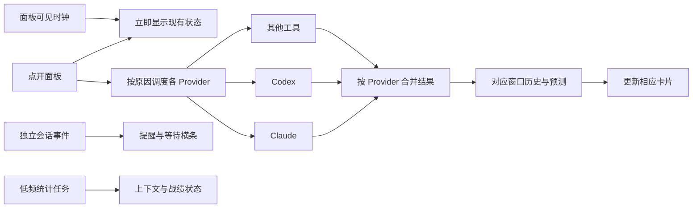

# PWE AI Bar 功能、响应速度、及时性与多工具估计优化方案

日期：2026-09-06。基线：`4fbd3b3bf357a0f58bbc1d96eb8e6dbc9b4af6f7`，工作区检查时干净。

本轮为审查与方案：读取当前源码，运行现有测试，使用隔离合成数据执行诊断与渲染。应用实现不作修改。本文取代上一份研究报告中关于 PWE 尚未接入在线 Codex、尚无耗速历史的旧描述。

## 1. 我的判断

**这个版本已经有一个可用菜单栏工具的主要结构，但还不适合把“续航”和“到重置还剩多少”当作可靠决策依据。优先级应当是数据可信度 → 各工具独立更新 → 工具与窗口选择 → 预测表达与性能打磨。**

目前最值得保留的是：复用的 popover、非主线程的数据读取、独立的一秒会话事件检查、分数据源的缓存、基于实际观察时间的历史样本，以及“近期耗速 / 开窗平均”的区别。

主要不足集中在连接处：Provider 错误状态没有完整到达界面；一轮查询仍要全部结束才发布；缓存时效不一致；历史没有账户、来源和窗口世代身份；面板无法主动选择要分析的工具。

| 维度 | 当前判断 | 证据边界 |
| --- | --- | --- |
| 功能实现 | Claude/Codex 额度主路径已接入，其他五家有适配代码；上下文、hooks 和战绩仍主要属于 Claude | 代码与合成测试已核对；本轮未逐家验证真实账户 |
| 点开流畅度 | 打开面板不等待网络，结构方向正确；第一次构建 SwiftUI 图仍有开销 | 合成七工具面板首次构建/布局约 104ms，不能等同真实点击延迟 |
| 新数据出现速度 | 一家慢会延迟整轮结果，即使其他家早已成功 | `Store.refresh()` 串行阶段，结尾统一发布 |
| 及时性 | 会话事件比额度更新可靠；额度正常为分钟级，空闲时可放大至十五分钟级 | 由代码调度推导，不是全链路实测 SLA |
| 耗速与续航 | 已有基础算法，缺少严格 freshness、来源隔离与可信度门槛 | 多个问题已用当前代码合成复现 |
| 多工具选择 | 数据模型能承载多工具，但“速率/续航”区域没有工具或窗口选择器 | `focused` 固定返回 `snap.protagonist` |
| 成本估计切换 | 尚不能切到 Codex/Cursor 等的成本统计 | `Transcript` 只扫描 Claude 项目日志 |

这里的“速率”是**额度消耗速度，单位为百分点/小时**，不是模型生成 token/s。续航是保持某种消耗节奏的条件估计，不代表 AI 模型执行速度。

## 2. 本轮检查与实测

### 2.1 基线检查与现有测试

检查了 `AppShell`、`PanelView`、`EnduranceView`、`Store`、`History`、`Model`、Claude/Codex/Extra Providers、设置、统计与通知规则。

实际执行：

```bash
git status --short
git log -3 --oneline

CLANG_MODULE_CACHE_PATH=/private/tmp/pwe-audit-20260906-clang \
SWIFT_MODULECACHE_PATH=/private/tmp/pwe-audit-20260906-swift \
PWEBAR_TEST_ARTIFACTS=/private/tmp/pwe-audit-20260906-ui \
swift test --disable-sandbox --scratch-path /private/tmp/pwe-audit-20260906-build
```

首次默认构建因 Clang ModuleCache 位于不可写目录而失败；将构建缓存放到临时目录后成功编译并运行测试。`--disable-sandbox` 用于 SwiftPM 子进程，外层工作区权限仍生效。

**测试结果：70 项执行，69 项通过，1 项失败。** 失败项为 `HookTests.testStaleInstalledScriptIsDetectedAndRefreshedInPlace`；日志报告 Cocoa Code 4，涉及测试 suite 的 Preferences plist 不存在，定位到测试第 161 行。没有建立失败的历史基线，不能称为“已知旧错误”或简单归因于产品 hook 功能。

另外直接读测试发现，该用例使用 `HookProvider.script` 的真实用户目录路径，并尝试备份、覆写和恢复。这不符合隔离测试应有的边界。应先改成注入临时路径，再重跑；不通过提升权限让它接触更多真实配置。[HookTests:149][c-hooktest]

### 2.2 对当前已编译代码的合成诊断

诊断程序通过 `@testable import PWEAIBar` 调用当前实现，凭据/网络由合成 exchange 替代，没有启动真实 Codex 查询。程序与结果已保存：

- [AuditProbe.swift](</Users/leeliu/Documents/ClaudeProject/PWE AI Bar/docs/audits/2026-09-06/AuditProbe.swift>)
- [synthetic-results.txt](</Users/leeliu/Documents/ClaudeProject/PWE AI Bar/docs/audits/2026-09-06/synthetic-results.txt>)

| 场景 | 当前实际返回 | 判断 |
| --- | --- | --- |
| Codex 第一次成功，301 秒后请求失败 | `percent=40, stale=false, age=301` | 错误没有转为 stale |
| 同一读数在 901 秒后，重置时间已过 | `percent=40, stale=false, resetPassed=true` | 仍保留有效比例外观；应待确认 |
| Codex 服务端比例为 99.6 | `confirmedExhausted=true` | 将显示舍入边界当成耗尽事实 |
| 40% 读数是一小时前观察到的 | 仍计算 13.33 点/时与重置时 66.67% 已用 | 新鲜度不足，且平均值分母随现在增长 |
| 历史已有 t=1200s 的 20%，随后收到 t=300s 的 10% | 历史变成一条旧的 10% | 乱序事件先触发清空，后检查时间，顺序错误 |
| 其他工具成功后断网 | 窗口数变成 0 | last-good 被失败结果覆盖 |

以上为可重复的合成反例，不代表本轮对 Lee 的真实账户进行了读取。

### 2.3 视觉与局部性能

从当前代码渲染七家工具各两个窗口，完整模式为 **340 × 1030pt**。这是结构压力样本，工具所配窗口是合成数据，不代表各供应商实际都返回相同窗口。

构建 `NSHostingView` 并完成布局，首次约 **103.8ms**；之后十次重新创建/布局，中位数约 **29.0ms**、最大约 **29.7ms**。这是 Debug、同进程、合成视图测量；没有测 `NSPopover.show`、真实鼠标事件到首帧、Release 性能或复用 popover 的热打开。不能把 29ms 写成产品“秒开”的证明。

主面板没有 `ScrollView` 或屏幕高度约束，1030pt 内容在较矮可用区域存在溢出/不可达风险；实际系统裁剪行为仍需真实 popover 验证。[PanelView:24][c-panel]

合成面板截图：[七工具完整面板](</Users/leeliu/Documents/ClaudeProject/PWE AI Bar/docs/audits/2026-09-06/seven-providers-full.png>)。

另外检查了现有测试生成的设置与待确认面板，以及应用自带 `--endurance` 生成的状态样本。没有启动正常应用入口，避免触发真实登录读取、hook 更新或通知。

## 3. 优先问题与修复验收

### P0-1：Codex 缓存会掩盖失败和跨窗口过期

`liveReading()` 失败时仍保留旧 `live`，并更新 `liveAt=now()`；返回的窗口没有标 stale。只要旧值非空，`windows()` 就继续返回它，日志回退也不会执行。缓存命中时没有“重置时间已过”的失效条件。[CodexProvider:52][c-codex]

影响：看似成功刷新，实际可能一直展示旧值。到重置之前，旧值仍可参与预测；到重置之后，续航图已有 guard 会停止投影，但主额度仍可能保留 fresh 外观。

**修复：** 拆成 `lastAttemptAt`、`lastSuccessAt`、`nextRetryAt`。失败只改变尝试和错误状态，不延长成功快照的有效期；旧值标 stale。跨重置后保留旧观察作说明，主比例进入待确认。只有账户/来源可确认一致时才启用日志后备。

**验收：** 上述 301s 和 901s 反例分别得到 stale、awaitingConfirmation；失败不会增加成功时间，不产生恢复提醒。

### P0-2：历史和预测缺少身份与新鲜度约束

历史 key 只有 `provider:id`；没有账户、数据源或 reset 世代。`observe()` 在拒绝旧时间戳之前先按百分比下降清空历史。预测只检查 `isStale`，没有检查实际观察年龄；`averagePace()` 用 now 减窗口开始来除以旧读数。[History:44][c-history]、[Model:94][c-burn]

影响：账户/来源切换可能形成假耗速；晚到的旧数据会破坏较新记录；没有新观察时，平均耗速可以自行变慢，让预测越来越乐观。

**修复：**

1. 先验证数值与时间顺序，再处理重置、下降和异常跳变。
2. 历史 key 至少包含 provider、account fingerprint、bucket/window、source、reset generation。
3. 同一世代 `observedAt <= last.observedAt` 直接忽略，不能修改 ring。
4. freshness 由来源、上次成功、错误和窗口重置共同计算，不依赖调用者手动传一个 Bool。
5. 开窗平均固定以最后观测时间为分母；界面时钟只能推进倒计时，不制造新测量。

**验收：** 乱序样本不改变较新 ring；切账户不混样；一小时旧读数不能展示“近期实测”；没有新数据时平均率不因重绘变小。

### P0-3：99.5% 被当作已耗尽

Claude 部分映射、Codex 在线/日志映射和其他工具共用窗口构造使用 `>=99.5` 设置 `confirmedExhausted`。这会把 99.6% 的“接近上限”变成“已用尽”，并可能触发耗尽提醒。[CodexAppServer:94][c-server]、[ExtraProviders:88][c-extra-window]

**修复：** 显示舍入与领域状态分离。有服务端明确耗尽状态则采用；否则有效原始比例达到 100 才确认耗尽。99.6% 可显示 99.6% 或“<1% 剩余”，不宣布停止可用。

**验收：** 99.49、99.5、99.99、100 和“服务端明确耗尽但无比例”分别测试；前三级不能产生已耗尽事件。

### P1-1：新读数等待整条串行流程

目前实际顺序为：Claude → Codex → Extra task group 全部完成 → History → Transcript → `snapshot = snap`。Extra 内部并发并不意味着 Claude/Codex 可以先显示。[Store:122][c-store]

点开时 `store.refresh()` 只启动异步任务，随后立即 `popover.show()`，所以不能直接说“每次点开都等网络”。真正的问题是：先打开旧面板，等整轮完成才看到变化，缺少每家刷新反馈。[AppShell:126][c-shell]

**修复：** 每家独立 fetch、独立合并 ProviderState；先发布额度与错误状态。History 只处理该次有效观察。Transcript 的上下文、战绩改成独立任务，不能成为额度发布的前置依赖。

**验收：** 合成 A=50ms、B=10s、统计=5s；A 完成后 100ms 内进入界面，不能等 B。慢工具只能显示自己的“更新中”。

### P1-2：错误信息和连接状态在数据层丢失

`ExtraStore` 计算 connections，但 `Store` 仅合并 windows/plans；失败覆盖旧 reading 后工具会从面板消失。设置显示的是单次本地检测结果，不是该工具当前请求结果。Codex 的真实失败也统一折成 nil，无法区分登录、网络、协议和超时。[ExtraStore:423][c-extra-store]、[SettingsView:224][c-settings]

**修复：** `ProviderState` 保存 last-good、connection、fetchError、source、attempt/success 时间。开启追踪的工具保留卡片，展示“未登录/访问失败/暂时离线/当前账户无额度”等实际原因；设置和面板消费同一份状态。

**验收：** 断网保留同账户旧读数并标时间；明确登出清掉可被误认的账户读数；工具不因一次 5xx 无声消失。429 保留 Retry-After 并遵守冷却，不能在网络层丢掉响应头。

### P1-3：追踪开关、立即刷新和面板时钟不够及时

- `Prefs` 变化只触发菜单图标 redraw，没有调用 Store 的追踪变更方法。旧 snapshot 还在，所以关掉后可继续显示，开启后可能要等调度。
- 一轮请求中关掉工具没有对应 generation/cancellation，迟到结果仍可发布。
- 手动刷新与点开都调用普通 `refresh()`，受现有 in-flight 与 Provider TTL 限制；没有“刷新已接受/缓存有效/冷却中”的反馈。
- 空闲调度为 300/900 秒。面板打开没有改变调度策略；窗口临近重置也不会单独唤醒 Store。
- 面板内 `Date()` 只是重绘时读时间，没有专门的可见时钟，倒计时和“几秒前更新”可能停着。[Store:75][c-cadence]、[AppShell:43][c-prefwatch]、[PanelView:124][c-panel]

**修复：** 添加 `setTrackedProviders`、`setPanelVisible`、`refresh(reason:)`；关追踪立即移除展示并隔离迟到请求。手动刷新允许越过正常缓存 TTL，但不能越过限流和最短防抖。面板可见时用轻量 UI clock 更新标签，网络有独立时钟。

**验收：** 开关 100ms 内体现；面板开着时倒计时按显示精度更新；关闭面板停止局部 clock；冷却中点击会显示下次允许时间；过重置按计划发起一次查询。

### P1-4：续航图视觉关系与文案有歧义

当预计耗尽晚于重置，图把 reset gate 移到中间，但 `axisLabels` 仍把重置时间贴在最右端。文字和标线不再指向同一时刻。[EnduranceView:74][c-endurance]、[axisLabels:283][c-axis]

当前“够用”合成结果：


建议将主时间轴固定为“现在 → 本次重置”，重置始终在右端。预测耗尽发生在重置之前时画标记；重置之后仅显示“按当前节奏可到重置，预计剩余约 X%”。避免将重置后的理论耗尽时长用一个大数字表现成不中断的可用时间。

文案也需明确条件：“按最近 30 分钟节奏，预计约 1 小时后用尽”；“开窗平均推算，参考性较低”。无观察增量应显示“近期未观察到消耗”，不要直接用平线推出可信的长期安全结论。

**验收：** 够用、刚好、不够、未知、过期、零变化均有独立正确状态；重置文字与标线对应；耗速单位可通过说明解释为“百分点/小时”。

## 4. 如何加入不同 AI 工具的选择

**可以做，且主要是选择状态和能力模型的补充，不需要重写 EnduranceView。** 当前它已经接收任意 `QuotaWindow`；限制来自 `PanelView.focused = snap.protagonist`。[PanelView:401][c-focus]

### 4.1 三个概念独立

| 选择 | 作用 | 是否停止其他工具查询 |
| --- | --- | --- |
| 设置中的“追踪” | 决定哪些工具参与采集 | 是 |
| 面板“关注工具/窗口” | 决定主区域分析谁 | 否 |
| 菜单栏显示项 | 决定菜单栏显示哪些读数 | 否；可后续补齐 |

不能通过关掉 Claude 来迫使续航显示 Codex；这会影响提醒和数据积累。

### 4.2 建议交互

主区域顶部加入两个原生控件：

```text
关注  [自动：最需关注 ▾]       窗口 [五小时 ▾]

Codex · 五小时窗口                 在线 · 1 分钟前
剩余 48%
最近 30 分钟耗速 12 点/时
按这个节奏，预计可到重置，剩余约 8%
[ 现在 ───────────────── 本次重置 ]
```

- 工具菜单：自动、Claude Code、Codex，以及已开启追踪的其他工具。
- “自动”保留目前主动提示的价值；用户指定工具后不因另一家读数稍高而抢走分析区。
- 指定工具可选“自动窗口/五小时/周/模型专属池”等实际返回项；没有字段不造一个窗口。
- 点击下方额度行，设为当前关注窗口，并有明确选中状态；供应商标题上的“打开工具”保留独立操作，避免一处点击承担两个意思。
- 选项持久化为 `provider + bucket + windowID`，不能只保存数组下标、显示标题或 channel。
- 所选工具无数据时保留选择，显示原因和重试入口，不悄悄跳回另一家；关闭追踪后提示并回到自动。
- 会话等待事件改成顶部高优先级横条，保留已选分析区；避免等待事件让用户无法继续比较额度。
- 自动模式在本次打开期间保持稳定，新增明确耗尽/等待事件立即提示；一般轻微排名波动不反复切主角。

此处提供的是产品方案，尚未实现选择器，也没有把选择和查询开关混在一起。

### 4.3 能力按数据判断，不按品牌承诺

| 工具 | 当前代码的数据条件 | 估计能力建议 |
| --- | --- | --- |
| Claude | 比例、重置与常见窗口长度，History 可采样 | 近期趋势与开窗参考均可，但先修时效/账户问题 |
| Codex | App Server 比例、重置、duration；日志作为历史来源 | 在线 fresh 才形成实时预测；日志单独标历史参考 |
| Cursor | 比例及账期终点，当前没有传 windowLength | 样本足够可做近期趋势；无真实开始时间不做开窗平均 |
| Copilot | 部分账户有限额比例与重置；无限量当前被省略 | 有限池可趋势分析；无限量显示“不适用” |
| Antigravity | quota bucket 的比例与重置；当前没有传 windowLength | 根据独立池历史与身份做趋势，不借用 Claude.ai 订阅历史 |
| Devin | 当前映射传日/周窗口长度 | 有新鲜实测后可估计；固定周期假设仍需供应商验证 |
| Grok | 当前映射传周长度 | 同上；不要把别家同名 weekly 的语义当成保证 |
| Gemini | 当前产品没有支持的额度源 | 显示“当前版本不支持额度读取”，不能生成假预测 |

`burn()` 的近期采样分支本来可以在不知道总窗口长度时工作。因此 Cursor/Copilot/Antigravity 可以支持“近期耗速”；如果缺 reset，只展示耗速，不回答能否到重置。界面不应把“没有长度”当成所有估计均不可用。[Model:94][c-burn]、[ExtraProviders:88][c-extra-window]

### 4.4 如果“估计”也包括成本与战绩

当前完整面板的 24 小时图和战绩来自 `~/.claude/projects`，不随主区域工具变化。将来选择 Codex 后，如果下面仍显示 Claude 等效金额却不标来源，会产生混淆。[Transcript:21][c-transcript]

短期：明确标“Claude 本机用量 · API 等效估算”；顶部工具选择只改变额度分析。没有其他工具 token 记录时，成本页显示暂不支持。

后续单独增加 provider/session/model 维度的 UsageLedger；每家明确 token、缓存计费和账期来源，再允许工具切换或合计。不能从订阅百分比推算精确美元，也不能从额度下降推导生成 token/s。

当前成本模型另有两点需要修订：未知模型返回 0，应改为“未计价 token 数/覆盖率”，让小计承认不完整；订阅成本以活跃天数按月价折算，会夸大“回本倍数”，应要求实际账期与订阅金额，或改名为明确假设下的比值。[Pricing:59][c-pricing]、[Transcript:210][c-cost]

本轮没有重新核对所有模型单价，本文只判断计算口径和数据来源，不对现有美元估计的市场价格准确性背书。

## 5. 预测算法怎么改

### 5.1 保持简单，但明确证据强弱

建议将计算从 View 和 `QuotaWindow` 扩展中收敛为纯函数 `ForecastEngine.evaluate(window, history, now, policy)`，输出一次完整 `Forecast`。EnduranceView 直接渲染，避免同一 body 多次调用 burn/plan/投影。

输出状态建议：

```text
unsupported       没有可用额度指标
insufficient      样本不足
stale             读数过时或最近请求失败
collecting        已有有效读数，正在积累样本
flat              期间未观察到净增长
recentTrend       根据近期有效样本推算
windowAverage     仅根据开窗以来累计比例估算
exhausted         服务端或原始值明确用尽
awaitingReset     重置已过，等待新观测
```

每个结果带 `basedOnObservedAt`、`sampleSpan`、`sampleCount`、`ratePointsPerHour`、`estimateKind`、`confidenceReason`；UI 不再通过“有没有某个数字”反推原因。

### 5.2 建议首版策略

1. 严格排除账户/来源/世代不匹配、乱序、未来、无效比例的样本。
2. 用实际观测间隔计算斜率，不能按轮询次数当时间，也不能把重复 cache 当新样本。
3. 短窗口先采用最近约 30 分钟的观察；周/月窗口用较长覆盖，并明确实际样本跨度。具体范围作为可测参数，不因距 reset 变小而突然切到完全不同算法。
4. 提议至少三个有效样本且跨越十分钟，再显示“近期趋势”；还需考虑服务端比例舍入精度，低于可分辨变化时显示 flat/insufficient。
5. 用时间加权斜率或稳健拟合减少单点跳变影响；先用合成轨迹与未来样本回测选择，不为复杂而引入机器学习。
6. 没有足够近期样本时，可折叠显示开窗平均，不能用相同视觉权重给出精确到分钟的承诺。
7. 投影以最后观测为基准。没有新数据期间，只推进预测时间坐标与数据年龄，不改变已测得率；超过 fresh budget 停止预测。
8. “按此节奏可到重置”使用条件表达；必要时显示保守范围，不输出伪造的统计置信区间。

基本公式仍是：

```text
耗速 = 已用百分点变化 / 观察间隔小时数
理论剩余时长 = (100 - 最后观测已用百分比) / 耗速
理论耗尽时刻 = 最后观测时间 + 理论剩余时长
```

速率为零不代表未来永远不会消耗；窗口重置时刻不一定意味着离散计费模型完全线性。没有经验证的固定窗口语义，不输出“开窗以来”平均。

### 5.3 历史容量按时间覆盖设计

当前 50 样本上限在一分钟采样下仅约 49 分钟；在五分钟采样下约 4 小时。周窗口代码虽然希望看一天多的趋势，容量并不能保证这种覆盖。[History][c-history]

建议短窗口保留细粒度记录，长窗口按 15/30 分钟分桶，保留首末值、最大值和有效观察数；设置天数与字节双上限。先定义短/长窗口的最小覆盖，再决定 cap，避免只换一个更大的数组常量。

## 6. 响应速度与及时性架构



### 6.1 点开面板

- 保留现有 popover 复用、关闭系统开合动画和外部点击/Escape 关闭。
- 点击路径只做展示与轻量选择恢复；不得同步查钥匙串或遍历日志。
- 面板宽度保持现有 340pt，按屏幕可用高度设上限，中部工具卡片滚动；页头、关注选择与主要读数优先可见。
- 不立刻启动时预热全部视图。先测 Release 真正首次打开成本，只有超标才在空闲时预建少量主视图。
- 设置窗口也需异步初始化 token 状态：当前构造 `SettingsView` 会读取 `Credentials.hasOwnToken`，它可能同步访问钥匙串；来源探测已经异步，但尚未覆盖这条路径。[SettingsView:16][c-settings-init]

### 6.2 刷新调度

下表是建议策略，不是供应商允许请求频率的声明；限流响应始终优先。

| 触发 | 行为 |
| --- | --- |
| 正常后台 | 按 Provider 下一次到期独立调度；没有必要每轮跑所有子系统 |
| 活跃任务/最近观察增长 | 对受影响工具适当缩短周期，不无差别提高七家频率 |
| 点开面板 | 先显示，优先请求所选工具；有效缓存可复用但显示观察时间 |
| 手动刷新 | 单家/全部均有明确入口；去重，跳过普通 TTL，遵守 Retry-After |
| 重置临近 | 按绝对 reset 时间安排一次带少量抖动的查询；服务端暂未更新则有限重试 |
| 唤醒/网络恢复 | 使相关 cache 到期并安排新尝试，不简单调用可能仍命中缓存的 refresh |
| 关闭追踪 | 立即停止该工具的后续查询，迟到结果不发布，取消对应 pending UI 状态 |
| 面板隐藏 | 停止高频 UI clock，保留必要后台额度和事件调度 |

### 6.3 Codex 子进程

先修协议与错误报告，再决定是否常驻：

- 初始化结果成功后再发送 initialized 和额度请求，避免把三条消息一次写完当作可靠握手。
- stdout 增量按行解析，避免每 50ms 重解析整个累积 buffer。
- stderr 也有字节上限；当前 `readDataToEndOfFile()` 无独立容量上限。
- 区分进程未找到、退出、超时、JSON-RPC 错误、身份失效与结构不支持。
- 把停止与 generation 贯穿 Store/Provider/transport；`Store.stop()` 当前只停计时器，不取消已启动刷新。
- 为 stdout/stderr EOF、子进程退出和资源回收设计统一 deadline；不能仅根据注释宣称“绝不等待”，代码仍调用 `waitUntilExit()`。

在 Release 比较短进程查询和常驻 App Server 的启动、footprint、idle CPU、休眠恢复后选择。避免为了少一次启动就引入长期驻留大进程。[CodexAppServer][c-server]

### 6.4 统计任务

`Transcript` 已有增量字节读取，但每轮仍枚举日志树并汇总所有文件 digest。应与在线额度解耦，增加文件变更/最近活跃索引，统计页不可见时降低组装频率；维护统计缓存，不反复重扫所有文件寻找“没变化”。[Transcript:74][c-transcript-refresh]

`TrophyView` 当前打开时获得值类型 snapshot，保持打开不会自动获得后续 Store 的新统计；应接入统计专用 Observable 状态。价格表来源、未知模型覆盖率与统计时间一并显示。

## 7. 推荐验收指标

这些是优化后的目标，不是本轮达成值。Apple 将超过约 100ms 的离散交互延迟视为开始可感知，提醒将主线程工作控制在更小预算内。[Apple 响应性文档](https://developer.apple.com/documentation/xcode/improving-app-responsiveness?changes=_8&language=objc)

| 指标 | 建议目标 | 测法 |
| --- | --- | --- |
| 真实热打开 | 点击到可交互首帧 p95 ≤100ms | Release，真实 popover，至少 30 次，区分第一次 |
| 首次打开 | p95 ≤200ms，超过则定位主线程阶段 | 清晰记录进程/字体/视图预热状态 |
| 切工具/窗口 | p95 ≤100ms，已有数据不等待网络 | 相同快照中切换所有可选项 |
| 单 Provider 发布 | 结果返回后 ≤100ms 到相应状态 | 用可控延迟 provider 注入 |
| 等待/回答 hook | 前台合成注入 p95 ≤2s，网络挂起仍成立 | 事件写入到界面/投递接受分别计时 |
| 追踪开关 | 界面立即反馈，关闭后的迟到响应不复活 | 暂停请求期间开关 |
| 重置确认 | 网络正常、未限流时 reset 后约 60–120s 尝试确认 | 测服务端观察与本地调度差，不保证服务器立即更新 |
| 预测完整性 | 所有 stale/换账户/乱序反例通过 | 固定时钟和合成轨迹 |
| 多工具可达性 | 七家加完整统计时全部可滚动访问 | 较小屏幕、多显示器、键盘与 VoiceOver |

使用 `os_signpost` 标记 click、show、首帧、provider start/end、publish、history、统计、通知接受；用 Instruments 的 Time Profiler/Hangs/SwiftUI 分别定位。局部视图可用 TimelineView 更新显示时钟，但不要让它顺带请求网络。[Apple TimelineView](https://developer.apple.com/documentation/SwiftUI/TimelineView)

## 8. 执行顺序与文件落点

| 顺序 | 工作包 | 主要文件 | 完成条件 |
| --- | --- | --- | --- |
| 1 | 数据真实性 | CodexProvider、CodexAppServer、ExtraStore、Model、History | P0 三类反例全部通过，时效和身份一致 |
| 2 | 独立状态与调度 | Store、Prefs、AppShell、新 ProviderState | 各家独立发布，开关/手动/唤醒/重置语义明确 |
| 3 | 关注选择与面板 | PanelView、Prefs、EnduranceView | 自动/工具/窗口可选，主面板可滚动，错误不消失 |
| 4 | 预测输出整理 | 新 ForecastEngine、History、EnduranceView | 近期/平均/未知分开，时间轴准确，附观测依据 |
| 5 | 点开与运行性能 | AppShell、SettingsView、CodexAppServer、Transcript | 真实 Release 性能达到目标或有明确测量解释 |
| 6 | 战绩口径与扩展 | Pricing、Transcript、TrophyView、可选 UsageLedger | 标清 Claude 范围、计价覆盖率；其他工具独立接入 |
| 实施前置 | 测试隔离修复 | HookTests、TestSupport、HookProvider 注入点 | 测试不得改真实 hooks/读取真实凭据；全套通过 |

第一批建议只做 1–3：**先让 Claude/Codex 读数可信且独立更新，再让用户自由切换关注工具和窗口。** 这批能直接改善日常使用，完整预测模型与更多成本来源后续跟进。

## 9. 验证清单与未验证部分

实施回归至少覆盖：

- Codex 成功→失败→过 reset；失败不能延长 success TTL。
- 99.6% 不确认耗尽；服务端明确耗尽可以无比例。
- 历史倒序、重复、换账户、换来源、窗口重置、百分比修正。
- 同一份旧数据多次重绘，实测速率不能变成新观察。
- A 快/B 慢/统计慢；A 应先发布；请求期间关闭工具。
- 无限量、无比例、有速率无 reset、无长度但有有效历史。
- 工具/窗口切换与等待事件同时出现，选择不会丢失。
- 所有工具启用、最小可用屏幕、长名称、缺失数据、深浅色与键盘导航。
- stdout 分片、大量 stderr、握手失败、无 executable、进程提前退出。
- 网络挂起时事件继续处理；停止后迟到任务不重新更新 UI。
- 统计仅属于 Claude 时，界面明确标来源；未知价格不能冒充免费。

本轮已证实代码路径、合成反例、局部布局与测试结果。**真实账户接口一致性、真正点击到首帧、持续运行功耗、各平台登录权限、实际通知送达与预测准确率回测仍未完成。** 本报告没有把源码中的旧耗时注释或 README 的性能数字当作当前实测。

源码快速索引：[Store][c-store]、[AppShell][c-shell]、[PanelView][c-panel]、[EnduranceView][c-endurance]、[History][c-history]、[Model][c-burn]、[CodexProvider][c-codex]、[CodexAppServer][c-server]、[ExtraStore][c-extra-store]、[Settings][c-settings]。

[c-store]: </Users/leeliu/Documents/ClaudeProject/PWE AI Bar/Sources/PWEAIBar/Core/Store.swift:122>
[c-cadence]: </Users/leeliu/Documents/ClaudeProject/PWE AI Bar/Sources/PWEAIBar/Core/Store.swift:75>
[c-shell]: </Users/leeliu/Documents/ClaudeProject/PWE AI Bar/Sources/PWEAIBar/AppShell.swift:126>
[c-prefwatch]: </Users/leeliu/Documents/ClaudeProject/PWE AI Bar/Sources/PWEAIBar/AppShell.swift:43>
[c-panel]: </Users/leeliu/Documents/ClaudeProject/PWE AI Bar/Sources/PWEAIBar/App/PanelView.swift:24>
[c-focus]: </Users/leeliu/Documents/ClaudeProject/PWE AI Bar/Sources/PWEAIBar/App/PanelView.swift:401>
[c-endurance]: </Users/leeliu/Documents/ClaudeProject/PWE AI Bar/Sources/PWEAIBar/App/EnduranceView.swift:74>
[c-axis]: </Users/leeliu/Documents/ClaudeProject/PWE AI Bar/Sources/PWEAIBar/App/EnduranceView.swift:283>
[c-history]: </Users/leeliu/Documents/ClaudeProject/PWE AI Bar/Sources/PWEAIBar/Core/History.swift:44>
[c-burn]: </Users/leeliu/Documents/ClaudeProject/PWE AI Bar/Sources/PWEAIBar/Core/Model.swift:94>
[c-codex]: </Users/leeliu/Documents/ClaudeProject/PWE AI Bar/Sources/PWEAIBar/Providers/CodexProvider.swift:52>
[c-server]: </Users/leeliu/Documents/ClaudeProject/PWE AI Bar/Sources/PWEAIBar/Providers/CodexAppServer.swift:77>
[c-extra-window]: </Users/leeliu/Documents/ClaudeProject/PWE AI Bar/Sources/PWEAIBar/Providers/ExtraProviders.swift:88>
[c-extra-store]: </Users/leeliu/Documents/ClaudeProject/PWE AI Bar/Sources/PWEAIBar/Providers/ExtraProviders.swift:423>
[c-settings]: </Users/leeliu/Documents/ClaudeProject/PWE AI Bar/Sources/PWEAIBar/App/SettingsView.swift:224>
[c-settings-init]: </Users/leeliu/Documents/ClaudeProject/PWE AI Bar/Sources/PWEAIBar/App/SettingsView.swift:16>
[c-transcript]: </Users/leeliu/Documents/ClaudeProject/PWE AI Bar/Sources/PWEAIBar/Providers/Transcript.swift:21>
[c-transcript-refresh]: </Users/leeliu/Documents/ClaudeProject/PWE AI Bar/Sources/PWEAIBar/Providers/Transcript.swift:74>
[c-cost]: </Users/leeliu/Documents/ClaudeProject/PWE AI Bar/Sources/PWEAIBar/Providers/Transcript.swift:210>
[c-pricing]: </Users/leeliu/Documents/ClaudeProject/PWE AI Bar/Sources/PWEAIBar/Core/Pricing.swift:59>
[c-hooktest]: </Users/leeliu/Documents/ClaudeProject/PWE AI Bar/Tests/PWEAIBarTests/HookTests.swift:149>
